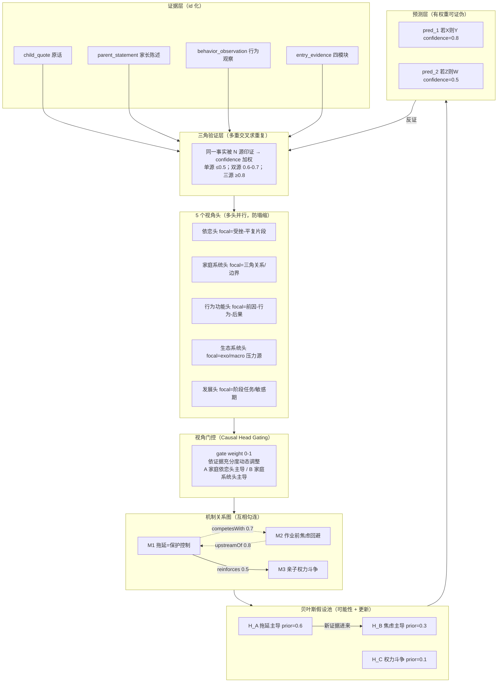

# 育见 · 深度画像 v4：多头交叉验证 + 权重网络 + 贝叶斯假设池

> Trae 2026-07-22 产出。基于：同行案例调研 + 学术方法借鉴（Repulsive Attention / Causal Head Gating / Triangulation）+ 现有 dossier 结构实证。
> 凌驾于 [product-memory-architecture.md](file:///Users/mac/Desktop/育见-2/.trae/documents/product-memory-architecture.md) Part 3 Q2 之上——那份讲"后台机制怎么演进"的总纲，本文档定义"画像本身该长什么样"。

---

## Part 0 · 你要的是什么（原话提炼）

> "关于家庭画像，以及可能的深度分析（我要的不是机制链，而是有权重有可能性有依据的深度完整互相勾连的分析），能不能再融入类似多重交叉求重复、多头注意力、权重等部分的设置"

拆解为 5 个关键词：

| 关键词 | 含义 | 当前 dossier 状态 |
|---|---|---|
| **有权重** | 不是"高/中/低"三档，是数值化 confidence + 证据计数 | ⚠️ 五Ps 有 confidence 0-1，但 predictions 只有 status 三态，mechanism 是 overallStrength 三档 |
| **有可能性** | 多假设并行，不是单一结论；带概率，可更新 | ⚠️ 有 alternativeReadings，但无 prior/likelihood，无贝叶斯更新 |
| **有依据** | 每条判断可回溯到具体证据 id | ❌ 全链路 string[]，不是 evidenceId 引用 |
| **深度完整互相勾连** | 证据-机制-假设-预测四层成图，不是平铺矩阵 | ❌ mechanism 间无边，证据无 id，不能回溯成图 |
| **多重交叉求重复** | 同一事实被多源印证才高置信 | ❌ 无显式 triangulation，confidence 靠 LLM 主观打 |
| **多头注意力** | 多视角独立判断再融合，视角间防塌缩 | ❌ portraitSynthesizer 是单 LLM 一次性产出，无多头分叉 |

---

## Part 1 · 同行调研：为什么没有可直接抄的先例

### 1.1 儿童AI硬件赛道（都在做陪伴/辅导，没做深度画像）

- **小天才手表**：社交+通话，不涉及画像
- **灵宇宙 Ling!**：学伴角色演绎，互动故事，不做家庭关系分析
- **Embodied Moxie**（已倒闭）：情感陪伴机器人，单机交互，无家庭系统视角
- **科大讯飞/学而思**：教育属性，聚焦学业，缺情感化设计（行业评论原话）

### 1.2 教育垂类大模型（聚焦解题，不聚焦家庭关系）

- **猿力科技"看云"**：覆盖家庭教育场景，但公开资料是学业辅导导向
- **网易有道"子曰"**：课后学业辅导 + 口语伴学
- **好未来"九章"**：数学解题能力突出

### 1.3 心理/家庭教育产品

- **简单心理 / 壹心理**：一对一咨询，AI 做分诊/轻问答，不做系统化家庭画像
- **家长帮 / 小盒科技**：家长社区 + 内容，不做个体化建模

### 1.4 结论

**家庭关系深度画像这个赛道，同行没有成熟先例。** 这是育见的差异化机会，但也意味着不能"抄优秀案例"，得自己设计。可借鉴的是**方法**而非产品：

- **临床心理学的 Case Conceptualization**（5P 模型 + 工作假设 + 备择解释）——已在用
- **贝叶斯推理**（多假设更新）——本文档新增
- **Triangulation（三角验证）**（质性研究方法）——本文档新增
- **Multi-head attention 的设计哲学**（多视角独立 + 交互 + 门控 + 防塌缩）——本文档新增

---

## Part 2 · 学术借鉴：三个核心思想

### 2.1 Repulsive Attention（EMNLP 2020）——防视角塌缩

论文：*Repulsive Attention: Rethinking Multi-head Attention as Bayesian Inference*

核心思想：多头注意力容易 attention collapse——不同 head 提取相似特征，退化成单头。该论文从贝叶斯视角把每个 head 当作一个粒子，通过排斥力让不同 head 覆盖不同子空间。

**映射到育见**：如果 portraitSynthesizer 让 LLM 同时产出依恋视角+家庭系统视角+行为功能视角，LLM 容易"偷懒"让三个视角产出相似内容（collapse）。需要**视角正交约束**：
- 每个视角头有明确的 focal dimension（关注维度），且 focal dimension 之间正交
- 产出后检查视角间相似度，过高则降权或要求重产

### 2.2 Causal Head Gating（NeurIPS 2025, Princeton）——动态门控权重

论文：*Causal Head Gating: A Framework for Interpreting Roles of Attention Heads in Transformers*

核心思想：给每个 attention head 学一个 soft gate（0-1），区分为 facilitating / interfering / irrelevant。head 的角色不是固定的，依赖与其他 head 的交互（low modularity）。

**映射到育见**：不是所有视角对每个家庭都同等重要。依恋视角对"受挫-平复"片段充分的家庭 facilitating，对只有学业抱怨的家庭可能 irrelevant。需要**视角门控权重**：
- 每个视角头有 gate weight（0-1），基于该视角的证据充分度动态调整
- 不同家庭的视角权重组合不同（A 家庭依恋头主导，B 家庭系统头主导）

### 2.3 Triangulation（质性研究方法）——多重交叉求重复

核心思想：同一现象被 ≥2 个独立来源印证，才认为可信。来源越独立（不同时间/不同观察者/不同模态），可信度越高。

**映射到育见**：同一事实被 child_quote + parent_statement + behavior_observation 三源印证，才上 0.8 confidence；单源只能 0.3-0.5。

---

## Part 3 · 现有 dossier 的诚实判定：中间态

基于对 [family-understanding-dossier.ts](file:///Users/mac/Desktop/育见-2/src/types/family-understanding-dossier.ts) + [portraitSynthesizer.md](file:///Users/mac/Desktop/育见-2/prompts/background/portraitSynthesizer.md) + [database.ts](file:///Users/mac/Desktop/育见-2/src/types/database.ts) 的实证：

### 3.1 已经具备的"网络性"（三处真交叉，不要推翻）

1. **sceneReadings.protectiveMix**：同一 protective 因素在不同场景被重新配比（{PR_t1:0.6, PR_t2:0.3} vs {PR_t2:0.7, PR_t1:0.2}）——这是真交织，不是单公式。SP 把它定为"违反=失败"的硬纪律。
2. **alternativeReadings + distinguishingEvidence**：保留竞争假设并写明"需什么证据区分"——可能性分支。
3. **prediction 验证闭环**：interventionTargets.prediction → workingHypothesis.predictions → status（unverified/failed/verified）→ 失败触发 L2 重概念化。

### 3.2 仍是"线性/扁平"的四处缺口

| 维度 | 现状 | 缺口 | 后果 |
|---|---|---|---|
| **predictions 权重** | 只有 status 三态 | 无 confidence 数值 | 无法区分"高把握预测"与"低把握预测"，反证≥2 一刀切全标 failed |
| **机制间关系** | `CandidateMechanism[]` 平铺 | 无 competesWith / reinforces / explainsSameBehavior 边 | 无法表达"M1 被 M3 削弱"、"M2 是 M1 的下游" |
| **证据引用** | 全链路 `string[]` | 无 evidenceId 引用 | 不能做证据-机制-假设-预测回溯图，无法验证"这条判断依据哪条原话" |
| **mechanism × scene** | mechanism 只有 `applicableScope: string` | dossier 的 sceneReadings 不在 mechanism 层 | 同一机制在不同场景的配比只存在于 dossier，mechanism 层丢失场景维度 |

### 3.3 判定

当前 dossier **不是"线性机制链"**（已有交织+竞争+验证闭环），但**也不是"有权重有可能性有依据的互相勾连的网络"**（依据扁平、机制无边、predictions 无数值权重）。处于**中间态**。

---

## Part 4 · 深度画像 v4 架构：多头交叉验证 + 权重网络 + 贝叶斯假设池

### 4.1 总架构



### 4.2 五大结构升级（对应你的 5 个关键词）

#### 结构 1：MultiHeadPerspectives（多头视角）——对应"多头注意力"

把 portraitSynthesizer 从"单 LLM 一次产出 7 段"升级为"5 个视角头并行产出 + 融合"。

```typescript
type PerspectiveHeadKey = 'attachment' | 'familySystem' | 'behaviorFunction' | 'ecological' | 'developmental'

type PerspectiveHead = {
  head: PerspectiveHeadKey
  focalDimension: string           // 该头关注的子空间（防塌缩的正交锚点）
  factors: DossierFactor[]         // 该视角下的因素
  mechanisms: CandidateMechanism[] // 该视角下的机制
  gateWeight: number               // 0-1，Causal Head Gating
  confidence: number               // 该头整体置信度
  evidenceRefs: EvidenceRef[]      // 该头依据的证据 id
}
```

**防塌缩机制（借鉴 Repulsive Attention）**：
- 5 个头的 focalDimension 之间正交：依恋头只看"受挫-平复"片段；系统头只看"三角关系/边界"；行为功能头只看"前因-行为-后果"链
- 产出后检查视角间内容相似度（embedding cos sim），> 0.85 则判塌缩，降 gateWeight 或要求重产
- SP 硬规则："每个头必须聚焦自己的 focalDimension，禁止跨域；跨域观察只能在融合层做"

**门控机制（借鉴 Causal Head Gating）**：
- 每个头的 gateWeight 基于该视角证据充分度：依恋头要看 ≥2 个"受挫-平复"片段才上 0.6；只有 1 个片段则 0.3
- 不同家庭视角权重组合不同：A 家庭（受挫片段多）依恋头主导；B 家庭（夫妻分歧明显）系统头主导
- 融合时加权：`dossier.workingHypothesis = Σ headWeight × head.hypothesis`

#### 结构 2：TriangulationLayer（三角验证）——对应"多重交叉求重复"

```typescript
type EvidenceSource = 'child_quote' | 'parent_statement' | 'behavior_observation' | 'entry_evidence' | 'transcript'

type TriangulatedFact = {
  factId: string
  content: string
  sources: EvidenceSource[]         // 哪些来源印证了这条事实
  sourceCount: number               // = sources.length
  independenceScore: number         // 来源独立性 0-1（不同时间/不同观察者/不同模态更独立）
  confidence: number                // 由 sourceCount + independenceScore 算出
  evidenceRefs: EvidenceRef[]       // 每个来源的具体证据 id
}

// confidence 计算（硬规则，非 LLM 主观打）
// 单源: 0.3-0.5
// 双源: 0.6-0.7
// 三源+: 0.8-0.9
// 四源+: 0.95
// independenceScore 调节：同来源多次（如 3 条 parent_statement）独立性低，confidence 不升
```

**硬规则**：
- dossier 里每个 factor / mechanism 的 confidence 必须由 TriangulatedFact 的 confidence 聚合而来，不是 LLM 直接打
- SP 输出时必须列 `evidenceRefs`，reviewer 检查"声称 confidence 0.8 但只有 1 个来源"则降级

#### 结构 3：MechanismGraph（机制关系图）——对应"互相勾连"

```typescript
type MechanismRelationType = 'competesWith' | 'reinforces' | 'upstreamOf' | 'explainsSameBehavior' | 'contradicts'

type MechanismEdge = {
  fromMechanismId: string
  toMechanismId: string
  relation: MechanismRelationType
  weight: number                    // 0-1，关系强度
  evidenceRefs: EvidenceRef[]       // 支持这条边的证据
  sceneNote?: string                // 在哪个场景下成立
}

type MechanismGraph = {
  nodes: CandidateMechanism[]       // 升级后带 sceneReadings
  edges: MechanismEdge[]
}
```

**升级 CandidateMechanism**：
- 加 `sceneReadings: DossierSceneReading[]`（从 dossier 层下放到 mechanism 层）
- 加 `relatedMechanismIds: MechanismEdge[]`（显式关系边）
- `supportingEvidence: string[]` 升级为 `evidenceRefs: EvidenceRef[]`（id 引用）
- `scores` 8 维保留，但 `overallStrength` 从三档升级为 0-1 数值（由 8 维加权算出）

#### 结构 4：HypothesisPool（贝叶斯假设池）——对应"有可能性 + 更新"

把 alternativeReadings 升级为贝叶斯假设池：

```typescript
type BayesianHypothesis = {
  id: string                        // H_A / H_B / H_C
  hypothesis: string
  prior: number                     // 先验概率 0-1（基于初始证据）
  likelihood: number                // 似然 0-1（新证据在该假设下的概率）
  posterior: number                 // 后验 = prior × likelihood / Σ
  supportingEvidence: EvidenceRef[]
  contradictingEvidence: EvidenceRef[]
  distinguishingEvidence: string    // 需什么证据区分
  status: 'prior' | 'updated' | 'confirmed' | 'falsified'
  lastUpdatedBy: string             // 哪条证据触发了更新
}
```

**贝叶斯更新机制**：
- 新 atom 入库时，检查它对各假设的似然
- `posterior = (prior × likelihood) / Σ(prior_i × likelihood_i)` 归一化
- 假设池始终保留 ≥2 个假设（禁止"单一结论"），即使某个 posterior > 0.9 也保留次优假设
- `distinguishingEvidence` 写明"做什么观察能区分 H_A 和 H_B"——驱动下一轮任务生成

#### 结构 5：EvidenceGraph（证据图）——对应"有依据 + 互相勾连"

全链路 id 化，替代 string[]：

```typescript
type EvidenceRef = {
  evidenceId: string                // 指向 CrossEntryEvidence.evidenceId 或 Atom.atomId
  weight: number                    // 0-1，该证据对当前判断的贡献
  quote: string                     // 原话片段（人类可读）
  source: EvidenceSource
  observedAt: string                // 观察时间
}

// 四层回溯图
// evidenceRef → mechanism → hypothesis → prediction
// 任意一层可向上回溯"这条判断依据哪条原话"
// 也可向下追溯"这条原话支撑了哪些判断"
```

---

## Part 5 · SP 改造：portraitSynthesizer v4

### 5.1 从单次产出改为多头分叉流程

```
[阶段 1：证据三角化]
  输入：所有 atoms + entry_evidence + transcripts
  输出：TriangulatedFact[]（每条带 sourceCount + confidence）
  规则：confidence 硬公式，非 LLM 主观打

[阶段 2：多头并行]
  对每个 PerspectiveHead（5 个）独立调 LLM：
    输入：TriangulatedFact[] + 该头的 focalDimension
    输出：该头的 factors + mechanisms + confidence
  规则：focalDimension 正交；禁止跨域

[阶段 3：防塌缩检查]
  计算 5 个头产出之间的 embedding 相似度
  相似度 > 0.85 的头对 → 降 gateWeight 或要求重产

[阶段 4：门控融合]
  按 gateWeight 加权融合 5 个头的产出
  gateWeight = f(该头证据充分度)
  输出：dossier 五Ps + sceneReadings + workingHypothesis

[阶段 5：机制关系图]
  对融合后的 mechanisms，调 LLM 标注 MechanismEdge
  输出：MechanismGraph（nodes + edges）

[阶段 6：假设池更新]
  对 alternativeReadings，做贝叶斯更新
  输出：BayesianHypothesis[]（带 prior/posterior）

[阶段 7：预测生成]
  对 workingHypothesis，生成带 confidence 的 predictions
  输出：DossierPrediction[]（带 confidence 数值）
```

### 5.2 防套模板的硬规则（你强调的"不要三个 homework loop 复读"）

- **机制非唯一**：workingHypothesis 必须引用 ≥2 个 mechanism，且至少 2 个有 `competesWith` 或 `alternativeReadings` 关系
- **场景非统一**：每个 mechanism 必须带 ≥2 个 sceneReadings，且 protectiveMix 配比差异 > 0.3
- **证据非抽象**：每条 factor/mechanism 必须引用 ≥1 个 TriangulatedFact 的 evidenceId，禁止只写"家长反映"
- **假设非单一**：HypothesisPool 必须保留 ≥2 个假设，最高 posterior 假设必须写明 distinguishingEvidence（怎么证伪它）

---

## Part 6 · 与现有代码的差距与落地路径

### 6.1 类型层改动

| 文件 | 改动 | 优先级 |
|---|---|---|
| [family-understanding-dossier.ts](file:///Users/mac/Desktop/育见-2/src/types/family-understanding-dossier.ts) | 加 PerspectiveHead[] / BayesianHypothesis[] / EvidenceRef；DossierPrediction 加 confidence | P0 |
| [database.ts](file:///Users/mac/Desktop/育见-2/src/types/database.ts) CandidateMechanism | 加 sceneReadings / relatedMechanismIds / evidenceRefs；overallStrength 改 0-1 | P1 |
| [database.ts](file:///Users/mac/Desktop/育见-2/src/types/database.ts) PendingHypothesis | 升级为 BayesianHypothesis；supportingEvidence 改 EvidenceRef[] | P1 |

### 6.2 SP 层改动

| 文件 | 改动 | 优先级 |
|---|---|---|
| [portraitSynthesizer.md](file:///Users/mac/Desktop/育见-2/prompts/background/portraitSynthesizer.md) | 从单次产出改为 7 阶段多头流程；加防塌缩/门控/贝叶斯规则 | P0 |
| 新建 `prompts/background/perspectiveHead.md` | 5 个视角头的通用 SP（focalDimension 约束） | P1 |

### 6.3 代码层改动

| 文件 | 改动 | 优先级 |
|---|---|---|
| [pipeline.ts](file:///Users/mac/Desktop/育见-2/src/lib/server/memory/deep-mechanism/pipeline.ts) portraitSynthesizer 步 | 拆为 7 阶段调用；阶段 2 并行 5 个头 | P0 |
| 新建 `triangulation.ts` | TriangulatedFact 构建 + confidence 硬公式 | P0 |
| 新建 `mechanism-graph.ts` | MechanismGraph 构建 + 关系标注 | P1 |
| 新建 `bayesian-update.ts` | 假设池贝叶斯更新 | P1 |
| [prediction-failure.ts](file:///Users/mac/Desktop/育见-2/src/lib/server/memory/dossier/prediction-failure.ts) | 反证 ≥2 改为按 confidence 降级，不一刀切 failed | P1 |
| [should-reconceptualize.ts](file:///Users/mac/Desktop/育见-2/src/lib/server/memory/dossier/should-reconceptualize.ts) | prediction_failed 判定加 confidence 阈值 | P1 |

### 6.4 落地优先级（嵌入 product-memory-architecture.md 的 Layer 4）

| 阶段 | 内容 | 对应关键词 | 时间 |
|---|---|---|---|
| v4-alpha | EvidenceRef id 化 + TriangulatedFact + confidence 硬公式 | 有依据 + 有权重 + 多重交叉 | 1 周 |
| v4-beta | 5 视角头并行 + 防塌缩 + 门控融合 | 多头注意力 | 2 周 |
| v4-rc | MechanismGraph 关系边 + BayesianHypothesis 假设池 | 互相勾连 + 有可能性 | 2 周 |
| v4-ga | predictions confidence + 反证降级 + L2 触发改造 | 权重更新闭环 | 1 周 |

---

## Part 7 · 与 product-memory-architecture.md 的关系

| product-memory-architecture.md | 本文档 |
|---|---|
| Part 3 Q2：后台机制该怎么写——分场景 + 权重 + 反证 | 本文档定义"画像本身的结构升级" |
| Layer 4：后台机制演进（sceneReading + 权重 + 质量评分） | 本文档是 Layer 4 的具体实现方案 |
| 铁律 1：机制不模板化 | 本文档的"多头 + 防塌缩 + 假设池"是反模板化的技术保障 |
| 铁律 2：前台事实锚定 | 本文档的 EvidenceRef id 化让前台能回溯"这条判断依据哪条原话" |

**执行顺序**：先做 [product-memory-architecture.md](file:///Users/mac/Desktop/育见-2/.trae/documents/product-memory-architecture.md) 的 Layer 0-3（管道通 + 双引擎前台），再做本文档的 v4（画像结构升级）。因为 v4 依赖 EvidenceRef id 化，而 id 化依赖 Layer 2 的 domainAtomFacts 独立通道。

---

## Part 8 · 验收标准

### 8.1 有权重

```sql
-- predictions 带数值 confidence
SELECT family_id,
  jsonb_array_length(data->'dossier'->'workingHypothesis'->'predictions') AS pred_n,
  AVG((elem->>'confidence')::numeric) AS avg_conf
FROM memory_layer_items, jsonb_array_elements(data->'dossier'->'workingHypothesis'->'predictions') AS elem
WHERE layer_name='deep_model_digest' AND data ? 'dossier'
GROUP BY family_id LIMIT 10;
-- 期望：pred_n >= 2，avg_conf 在 0.4-0.9 之间（不是全高或全低）
```

### 8.2 有可能性

```sql
-- HypothesisPool 保留 >=2 假设
SELECT family_id,
  jsonb_array_length(data->'dossier'->'alternativeReadings') AS hypo_n
FROM memory_layer_items
WHERE layer_name='deep_model_digest' AND data ? 'dossier' LIMIT 10;
-- 期望：hypo_n >= 2
```

### 8.3 有依据 + 互相勾连

```sql
-- 机制带 evidenceRefs（非空 string[]）
SELECT family_id,
  jsonb_array_length(
    jsonb_path_query_array(data->'candidateMechanismMatrix', '$[*].supportingEvidence[*]')
  ) AS total_refs
FROM memory_layer_items
WHERE layer_name='evidence_networks' LIMIT 10;
-- 期望：total_refs >= mech_n × 2（每条机制至少 2 条证据引用）
```

### 8.4 多头不塌缩

- 5 个 PerspectiveHead 产出之间 embedding cos sim 平均 < 0.7（防塌缩）
- gateWeight 分布有差异（不是 5 个头全 0.5，应有主导头）

### 8.5 反套模板

- 同一家庭的 mechanism 之间 ≥1 条 competesWith 边（有竞争关系）
- 每个机制 ≥2 个 sceneReadings 且 protectiveMix 配比差异 > 0.3

---

## 附录 · 关键借鉴源

| 来源 | 借鉴点 | 映射到育见 |
|---|---|---|
| Repulsive Attention (EMNLP 2020) | 多头防塌缩：头之间排斥力，覆盖不同子空间 | 5 视角头 focalDimension 正交 + 产出相似度检查 |
| Causal Head Gating (NeurIPS 2025) | 头角色动态门控：facilitating/interfering/irrelevant | gateWeight 基于证据充分度动态调整 |
| Triangulation（质性研究） | 多源印证才高可信 | TriangulatedFact sourceCount + independenceScore |
| 贝叶斯推理 | 多假设并行 + 先验/似然/后验更新 | HypothesisPool 贝叶斯更新 |
| Case Conceptualization（临床心理学） | 5P 模型 + 工作假设 + 备择解释 | 已在 dossier v2 用，v4 保留并升级 |
| 多头注意力 ICL (NeurIPS 2024) | 不同层用不同头数策略 | 阶段 2 并行 5 头，阶段 4 融合单输出 |
