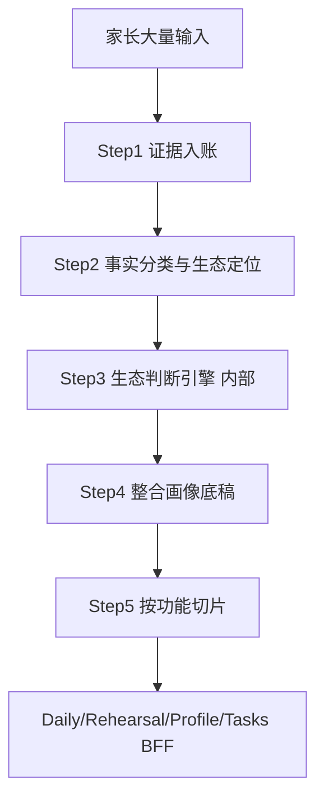

# 深度画像 v3 · 理论对齐与全链路重构方案

> **状态**：思考与设计阶段，**不改代码**。
> **理论真源**：`/Users/mac/Desktop/副本对话实验室中五大生态系统的教育理论与判断机制映射报告.docx`（已用 textutil 提取全文校准）
> **已有审计**：[fullchain-agent-audit-and-portrait-v2.md](./fullchain-agent-audit-and-portrait-v2.md)、[deep-mechanism-rethink-and-portrait-redesign.md](./deep-mechanism-rethink-and-portrait-redesign.md)

---

## 0. 理论文档与当前代码的核心差距（已用真源校准）

理论报告要求的是 **「分层判断引擎」**，不是 **「静态知识卡直出给前台」**。已用 textutil 提取报告全文核对，确认差距：

| 理论报告要求 | 当前代码现状 | 差距 |
|-------------|-------------|------|
| 先系统、后机制；先证据、后解释；先约束、后建议 | [`deepMechanismReview.md`](/Users/mac/Desktop/育见-2/prompts/background/deepMechanismReview.md) 要求每条机制 = 理论卡 + 家庭结构，`theoryCardId` 必填 | 顺序反了：先贴卡再解释 |
| 不做「主机制唯一归因」 | 产出 10–20 条 `candidateMechanismMatrix`，digest 取 top1 | 离散多卡 + 单叙事，两头丢信息 |
| **15 张卡**（5 系统 × 3），每张含 **9 个 rich fields** | [`theory-cards.ts`](/Users/mac/Desktop/育见-2/src/lib/server/memory/deep-mechanism/theory-cards.ts) 是 20 张，每张只有 4 字段（id/name/layer/scenarios/signals） | **数量不符（15 vs 20）+ 内核未入库**，SP 与代码双源漂移 |
| 置信度用证据规则硬约束（每卡自带"置信度规则"字段） | `overallStrength: low/medium/high`，`possibleCounterEvidence` 常空 | 无连续消长、反证通道弱 |
| 四功能共享底盘：证据槽 → 轻量/脚本/诊断/规划 | daily / rehearsal / profile / build 各走各的 Agent 链 | 握手薄、传递不一致 |
| 宏/外系统作「解释校准层」，不替代个体证据 | 机制卡混在 micro 层直喂前台 | 易把结构压力误判成孩子问题 |
| 时间系统：先时间线，再归因 | `getMergedParentInputHistory` 100 条取、30 条喂；无统一时间线对象 | 指纹与喂料分裂 |
| **MVP 分批落地**（第一批 4 张 / 一批半 4 张 / 二批 5 张 / 三批 2 张） | 20 张平铺，无优先级 | 全量上线风险高，应按报告分批 |

**结论**：不是「把机制卡写厚一点」就够，而是 **产出形态要从「卡矩阵」改成「理解底稿 + 内部判断引擎」**。

---

## 1. 两个 Job 的区别（保留，供后续 spec 引用）

### Job A · `episode_ingest`（情景/原子证据摄入）

- **文件**：[`episode/pipeline.ts`](/Users/mac/Desktop/育见-2/src/lib/server/memory/episode/pipeline.ts) `ingestEpisodeStrict`
- **做什么**：把家长**原始文本**抽成 **EvidenceEpisode + FactAtom**，**向量化**，供语义召回
- **一句话**：记「**发生过什么**」（可被查回的具体片段）

### Job B · `memory_write`（记忆写入）

- **文件**：[`write/decision-engine.ts`](/Users/mac/Desktop/育见-2/src/lib/server/memory/write/decision-engine.ts) `executeWritePlan`
- **做什么**：把结构化 **MemoryWritePlan** 写入多层记忆表（daily_updates、hypotheses、cycles 等），**不向量化**
- **一句话**：记「**我们目前怎么理解**」（字段化、可调度）

**互补**：episode = 语义轴；memory_write = 结构轴。v3 需新增：**每条事实还要标记「证据等级 + 生态层级 + 更新哪个画像切面」**。

---

## 2. v3 核心产品形态：Family Understanding Dossier（家庭理解底稿）

### 2.1 设计原则（对齐理论报告 + 你的三点反馈）

1. **孩子是主语**：画像围绕「这个孩子怎么活」，家庭结构是环境，不是被告席。
2. **复杂交织，不是单功能/单链条**：同一行为在不同场景意义可不同；多种力量同时存在、互相改变，**禁止**「拖延=保护 X」式单调等式。
3. **放弃机制链叙事作为主输出**：互动循环可作为**某场景的观察记录**，不能当画像骨架。
4. **理论隐身**：理论作 SP 内「思考透镜 + 自检清单」，**不出现在家长可见字段**（对齐报告每张卡的"用户可见表达 / 输出约束"字段）。
5. **拆分是为了前台灵活取用**，不是为了拆成互不相干的表：底层仍是一份 **自洽的整体理解**。

### 2.2 底稿结构（存储时可结构化，呈现时是「认识这个孩子」）

```text
FamilyUnderstandingDossier
├── evidenceLedger          # 证据账本：事实/原话/时间/来源/反证标记（只存事实，不混解释）
├── childSubject            # 这个孩子是谁：跨场景稳定观察 + 明确标注「待验证解释」
├── contextualStates        # 分场景状态：作业/冲突后/与父单独/升学转折… 同行为不同意义
├── interwovenField         # 交织场：几股力如何同时作用、互相牵动（ prose 段落，非功能列表）
├── parentPerspectives      # 家长各自：意图 vs 孩子接收 vs 实际影响（不审判）
├── integratedSynthesis     # 当前最可信的整体理解（200–500 字，一段成文）
├── alternativeReadings     # 竞争性解释 + 各需什么证据才能区分
├── calibrationNotes        # 内部：哪些生态层在起作用、用了哪些理论自检（不对家长展示理论名）
├── openObservations        # 还需继续看的点（可验证，非问卷）
└── growthEdge              # 最小可执行、可观察的撬动点（培优向）
```

### 2.3 与理论报告「四功能切片」的映射

| 功能 | 从底稿取什么 | 理论报告对应 |
|------|-------------|-------------|
| **日常 daily** | `integratedSynthesis` + 与本轮话题相关的 `contextualStates` 切片 + 1–2 条 `evidenceLedger` | 轻量卡：支持、追问、小步建议 |
| **预演 rehearsal** | `childSubject` + `contextualStates`（压力/批评/边界/暴露感）+ `parentPerspectives` | 单场景脚本卡 |
| **画像 Tab** | 全文底稿渲染为卡片（**由底稿投影**，不再从 matrix 猜六维） | 多系统诊断呈现 |
| **任务 tasks** | `growthEdge` + `openObservations` | 教育规划的前置 |

**BFF 三段式不变**：① 规则编排（不调 LLM）→ ② 组装包（改为 dossier 切片 + retrievalPack）→ ③ 表达层 LLM。

---

## 3. 后台工作流 v3：三步 + 内部判断引擎

理论报告 + 你的三步诉求，合并为：



### Step 1 · 证据入账（已有，需增强元数据）

- 来源：`episode_ingest` + 四模块 + `turn_events` + 高价值 atom
- **新增元数据**（写入时确定性标注，不全靠 LLM）：
  - `evidenceTier`：具体行为/原话/多次/跨场景/有结果对照 → 映射报告每张卡的"置信度规则"字段
  - `ecologicalLayer`：micro/meso/exo/macro/chrono（初步规则 + LLM 复核）
  - `factRole`：actor_action / child_reception / child_response / parent_interpretation / temporal_marker

### Step 2 · 事实分类（取代「为每张卡找匹配」）

- 新 Agent **`factEcologyClassifier`**（可合并原 `ecosystemClassifier` 前半）
- 输出：**结构化事实表 + 时间线**，不是 mechanismName 列表
- 硬规则（来自报告 20 条短句，已逐条核对）：单次冲突不得推断稳定模式；先收原话；先建立时间线

### Step 3 · 生态判断引擎（**内部**，不产出卡矩阵）

- 输入：事实表 + **完整理论卡库**（报告 15 张 rich fields，进 system 前缀做 prompt cache）
- 过程：
  1. 先判 **哪一层系统** 在解释本轮材料（micro 优先，exo/macro 仅校准）—— 对齐报告"先判系统层级，再判个体问题"
  2. 再选 **哪些理论透镜** 帮助思考（报告 MVP 顺序：教养控制 → 强制循环 → 家校/共同养育 → SDT → 发展任务…）
  3. 用 **每张卡自带的"置信度规则"字段** 定置信度上限（不是模型自我感觉）—— 报告每卡都有硬规则如"必须同时采到外部压力+家长情绪变化+孩子表现变化三段证据"
  4. **禁止** 输出 `theoryCardId` / 理论名给存储层家长字段
- 输出：`calibrationNotes`（内部）+ `alternativeReadings` + 对 `interwovenField` 的素材

### Step 4 · 整合画像 **`portraitSynthesizer`**（取代 mechanismSynthesizer 为主路径）

- 输入：事实表 + 引擎素材 + 现有 dossier（增量更新）
- 输出：**一份** `FamilyUnderstandingDossier`（不是 10–20 条卡）
- SP 要求：
  - 必须写清 **交织**（「几股力拆不开」）
  - 必须分 **contextualStates**（同行为不同场景不同意义）
  - 人格/气质表述必须带 **证据门槛**（报告：依恋等不可贴永久标签）
  - 家长是 **perspective** 不是 **verdict**

### Step 5 · 任务切片（确定性代码，非 LLM）

- `sliceForDaily(query, dossier)` / `sliceForRehearsal(scene, dossier)` 等
- 取代当前 [`formatMatchedMechanismCards`](/Users/mac/Desktop/育见-2/src/lib/server/memory/deep-modeling/pick-deep-model-digest.ts) 作为主注入源

---

## 4. 试验样例 v3（小宇家庭 · 体现「交织」而非单功能）

> 这是 **理解底稿的正文形态**，不是 yaml 字段表。

**这个孩子是谁**
小宇不是「懒」或「对抗型」——他对外部压力接收很快。妈妈一靠近书桌，他还没被开口，身体已经进入戒备。材料里反复出现的是：**他在高监控下优先保两样东西——今晚节奏的一点点自主权，以及不在当场暴露「不会」**。这两样在不同场景里配比会变，不是同一个公式的两种说法。

**分场景看同一件事**
- **作业开始前**：拖延更像在抢「什么时候开始」的最后口子；消极抵抗与自尊保护混在里面，以掌控为主。
- **检查订正时**：沉默配比变了——这时「怕暴露不会」更重，拖延反而不是主形态。
- **妈妈情绪好、不盯的晚上**（待验证）：若拖延减轻，说明监控密度是重要变量；若仍拖，任务难度或胜任感要上调权重。

**交织场（不是一条链）**
妈妈的焦虑（exo/macro：升学比较、「现在不抓来不及」）→ 她唯一执行者位置（meso：爸爸缺位）→ 高结构+高监控表达（micro：行为控制与心理控制边界模糊）→ 小宇接收为「不被信任」→ 他用拖延/沉默维持边界与可控感 → 妈妈读成态度差 → 升级。
**但**：同一沉默在「冲突后修复」若缺少，又牵动依恋层面的「可达性」疑问——这不是再加一张卡，而是 **同一段家庭生活在不同议题上同时成立**。

**当前整体理解（integratedSynthesis）**
小宇的问题不是单点「作业习惯」，而是 **在「妈妈独自扛学习+初一课业跳变」的结构里，他用拖延和沉默同时维持自主、自尊与关系安全**。踹门不是变坏，是稳态绷到极点。要帮的不是先改态度，而是 **先看清在不同场景里，他到底在保什么、什么条件下会松**。

**还需继续看**
- 爸爸单独在场的一晚，拖延是否变化？
- 沉默后妈妈是否间歇性放松（间歇强化）？
- 冲突后是否有修复片段（依恋证据）？

**可试的一小步**
选一晚：作业开始前 20 分钟完全不进房间；结束只问「今晚哪段最卡」。目的不是治拖延，是 **区分监控回应 vs 任务本身**——对齐报告阶段—环境匹配卡"先环境微调，再强化惩罚"。

---

## 5. 工程侧：必须先统一的三件事（审计结论）

### 5.1 触发策略（否则画像再深也会成本失控）

当前 **5 路叠加**入队 `deep_mechanism_review`（[`queue.ts`](/Users/mac/Desktop/育见-2/src/lib/server/jobs/queue.ts)）：

- 日桶（memory_write）
- **每条** episode_ingest
- 每 10 有效轮（[`turn-signal.ts`](/Users/mac/Desktop/育见-2/src/lib/server/memory/deep-mechanism/turn-signal.ts)，**已存在**）
- 登录 daily_open
- 四模块 build 完成

**v3 调度原则（设计，未实现）**：

| 事件 | 建议动作 |
|------|---------|
| 每条 daily 有效轮 | 仅 `episode_ingest` + L1 `memory_write` |
| 高价值 atom（原话/反证/材料） | 标记 dossier **增量候选** |
| 每 10 轮 / 指纹显著变化 / 四模块齐 | **全量** `portraitSynthesizer` |
| 日桶 | 仅 `digest_update` + brief/board，**不默认跑满 4 步 deep 链** |
| 租户 debounce 15min | 合并 pending deep job，保留最新 fingerprint |

### 5.2 家长输入窗口

- 已取 100、喂 30：[`pipeline.ts` L329–352](/Users/mac/Desktop/育见-2/src/lib/server/memory/deep-mechanism/pipeline.ts)
- v3：**fingerprint 与 LLM 喂料用同一窗口**（建议 100 条，单条 trunc 200 字），并写入 [`database-manager.ts`](/Users/mac/Desktop/育见-2/src/lib/server/memory/database-manager.ts) 统一常量

### 5.3 Prompt cache

- 理论 rich content（报告 15 张卡全文）→ **`portraitSynthesizer` / `theoryMatcher` system 尾部**（固定前缀）
- `THEORY_CARDS` JSON 从 user payload 移出（当前在 user → 每次 miss）
- 观测：已有 [`ark-agents.ts`](/Users/mac/Desktop/育见-2/src/lib/server/ark-agents.ts) `logCacheHit`

---

## 6. 需要改动的文档与契约（实施前必做）

| 文件 | 为何要改 |
|------|---------|
| [`docs/product/deep-modeling.md`](/Users/mac/Desktop/育见-2/docs/product/deep-modeling.md) | 现宪法强制「机制闭环」「互动循环五步」——与 v3 **直接冲突** |
| [`docs/contracts/read-contract.md`](/Users/mac/Desktop/育见-2/docs/contracts/read-contract.md) | `matchedMechanisms` 厚包上限 20 → 改为 dossier 切片字段 |
| [`prompts/back/deepModelDigestBuilder.md`](/Users/mac/Desktop/育见-2/prompts/back/deepModelDigestBuilder.md) | 单字段 `mechanismNarrative` → 多维底稿投影 |
| [`prompts/core/parentFacingStyle.md`](/Users/mac/Desktop/育见-2/prompts/core/parentFacingStyle.md) | 弱化 `interactionLoops` 五步链硬性；改引用 dossier 字段 |
| **理论卡真源** | 报告 15 张 rich fields → 替换/扩展 `theory-cards.ts`，与 SP 单源（见 §7） |

---

## 7. 理论卡真源校准（报告 vs 当前代码，已逐条核对）

### 7.1 数量与命名差距

| 报告 15 张（5 系统 × 3） | 当前 theory-cards.ts 20 张 | 差距 |
|------------------------|---------------------------|------|
| **微系统**：依恋 / 教养与控制方式 / 社会学习与强制循环 | 含依恋、亲职风格、强制循环 + 多出双ABC-X、双元孝道、Vygotsky、Erikson、皮亚杰、家庭韧性、Satir沟通、情绪社会化、社会资本、家庭边界 | 报告无后 10 张；报告"教养与控制方式"对应现"亲职风格"但内涵更细（含 Barber 行为控制/心理控制二分） |
| **中间系统**：家校合作 / 共同养育 / 结构家庭系统 | 含家校合作、共同养育 + 多出"家庭边界"（报告归入结构家庭系统） | 报告"结构家庭系统"= Minuchin，含边界/三角/父母化，比现"家庭边界"卡更全 |
| **外系统**：家庭压力模型 / 工作—家庭冲突 / 社会支持缓冲 | **当前代码完全缺失这 3 张** | 这是最大缺口——外系统 3 张卡理论库里没有 |
| **宏系统**：文化价值与教养信念 / SDT / 成就目标 | 含 SDT，缺文化价值、成就目标 | 文化价值卡是报告强调的高风险卡（易文化刻板化），必须有 |
| **时间系统**：发展任务 / 阶段—环境匹配 / 生命历程家庭生命周期 | 含阶段—环境匹配，缺发展任务、生命历程 | 发展任务是报告 MVP 第一批，必须补 |

**结论**：当前 20 张与报告 15 张**不是子集关系**——有 10 张报告没有（多来自旧 deepMechanismReview.md 的 20 卡清单），有 8 张报告有但代码缺/弱。**v3 必须以报告为真源重建理论卡库**，而非在现有 20 张上打补丁。

### 7.2 每张卡的 9 个 rich fields（当前代码只有 4 个）

报告每张卡含：
1. **核心观点**（理论内核 + 中国语境注解）
2. **适用场景**（具体产品场景列表）
3. **观察信号**（LLM 可识别的信号清单）
4. **判断维度**（结构化字段名，如 `autonomy_support/structure_quality/involvement`）
5. **置信度规则**（硬约束，如"必须同时采到三段证据"）
6. **推荐干预**（落地建议方向）
7. **禁忌建议**（不能怎么用）
8. **用户可见表达**（给前台的现成人话翻译）
9. **输出约束**（层级限制，如"外系统只能做情境解释，不能替代个体证据"）

当前 [`theory-cards.ts`](/Users/mac/Desktop/育见-2/src/lib/server/memory/deep-mechanism/theory-cards.ts) 只有 `id/name/ecosystemLayer/applicableScenarios/observationSignals`——**缺 5 个字段**，尤其缺"置信度规则"和"用户可见表达"，这正是前台单调、置信度离散的根因。

### 7.3 MVP 分批路线图（报告原文，已核对）

| 批次 | 理论卡 | 理由 |
|------|--------|------|
| **第一批** | 教养与控制方式、社会学习与强制循环、家校合作、发展任务 | 最易从原话/事件链抽取，低误判，立刻支撑日常对话+预演 |
| **第一批后半** | 依恋、共同养育、SDT、阶段—环境匹配 | 价值高但证据要求略高 |
| **第二批** | 结构家庭系统、家庭压力、工作—家庭冲突、社会支持、成就目标 | 解释力强但证据要求高/误判风险中高 |
| **第三批** | 文化价值与教养信念、生命历程/家庭生命周期 | 价值高但误判风险最高（文化刻板化/时间线依赖），作校准层 |

**v3 落地建议**：Phase C 先实现第一批 4 张 + 第一批后半 4 张 = 8 张 rich cards，覆盖 80% 高频场景；二批三批随证据采集能力完善再补。

### 7.4 报告 20 条硬规则短句（可直接进 SP，已核对）

报告末尾 20 条短句，与现 [`deepMechanismReview.md`](/Users/mac/Desktop/育见-2/prompts/background/deepMechanismReview.md) §理论纪律高度重合但更精炼，v3 SP 应直接采用报告版本：
先判系统层级再判个体问题 / 先看事件链不先贴性格标签 / 单次冲突不得推断稳定模式 / 先收原话再做理论映射 / 行为控制不等于心理控制 / 安全边界不等于高压控制 / 先找互动循环再追责对错 / 依恋判断必须看修复过程 / 家校频繁联系不等于协同好 / 父母离异不等于共同养育差 / 贫困不能直接推出失职 / 工作忙碌不等于不重视孩子 / 支持人数不等于支持可用 / 文化差异不能直接病理化 / 自主支持不等于放任不管 / 比较性反馈必须配进步反馈 / 年龄典型行为不先病理化 / 先建立时间线再做归因 / 证据不足时优先追问 / 高风险信号必须人工复核。

---

## 8. 经验沉淀（防止再犯）

写入 [`.agents/postmortems/`](/Users/mac/Desktop/育见-2/.agents/postmortems/) 或 [`.trae/documents/`](/Users/mac/Desktop/育见-2/.trae/documents/) 的教训：

1. **先审计产出形态，再怪前台 SP**：parentFacingStyle 已细，但 `mechanismNarrative` 单调 → 输出必然像豆包。
2. **不要用 schema 代替理解**：v1/v2 过早设计 yaml/权重表，用户要的是「认识孩子」的正文。
3. **理论报告 ≠ 当前 theory-cards.ts**：文档有完整判断机制（15 张 × 9 字段），代码只有标签袋（20 张 × 4 字段）——**必须先对齐真源**。
4. **触发源叠加是隐性成本**：「每 10 轮已有」不等于「只每 10 轮一次」。
5. **证据与解释必须分离**：`evidenceLedger` 与 `integratedSynthesis` 分存储，防 LLM 编造覆盖事实。

---

## 9. 分阶段实施顺序（待批准后再动代码）

### Phase A · 设计冻结（当前）
- 你确认 v3 底稿样例（§4）深度与形态
- 确认理论卡 rich fields 是否以 docx 为唯一真源导入（§7 已核对：是 15 张不是 20 张）

### Phase B · 低风险工程（可独立先行）
- 统一 parent input 窗口（100/100 + trunc）
- THEORY_CARDS → system 前缀（cache）
- deep job debounce + 触发 reason 标注
- 文档修正：memory-write 契约 vs episode 每轮入队

### Phase C · 核心重构
- `theory-cards.ts` 按报告 15 张 × 9 字段重建（先第一批 8 张）
- 新链：`factEcologyClassifier` → `portraitSynthesizer`（+ 可选 `structuralRiskExtractor`）
- 新存储 + digest 投影 + BFF 切片函数

### Phase D · 前台对齐
- daily / rehearsal / profile SP 改引用 dossier 字段
- 更新 [`DESIGN.md`](/Users/mac/Desktop/育见-2/DESIGN.md) 记忆来源表
- 契约测试 + 金路径人工验收

---

## 10. 待确认的关键决策

1. **底稿 §4 样例**：「交织场 + 分场景状态」是否达到你要的深度？还要不要独立「家长性格 / 孩子性格」段落（vs 融入 childSubject + parentPerspectives）？
2. **理论卡真源**：§7 已核对报告是 15 张（非现 20 张）。是否同意 **以报告 15 张 × 9 rich fields 重建 theory-cards.ts**（旧 20 张中报告未列的 10 张如双ABC-X/Vygotsky/Erikson 等如何处置：删除？降级为 SP 自检附录？）？机制卡"保持原名不重命名"是指保留现有 20 张命名体系，还是按报告 15 张重命名？
3. **MVP 范围**：Phase C 是否先做报告第一批+一批半共 8 张 rich cards，二批三批后补？
4. **实施顺序**：是否同意 **Phase B 先行**（输入窗口/cache/触发），**Phase C 等底稿形态确认后**再动 deep 链？
5. **理论隐身方式**：理论作 SP 思考透镜 + 产出后自检清单，不进 dossier 术语——这个折中可接受吗？还是要彻底删卡？

---

## 11. 理论真源校准注记（本次新增，基于 docx 全文核对）

本节是对用户 v3 方案的补强，基于用 textutil 提取的报告全文逐条核对：

1. **15 vs 20 张**：用户 v3 方案 §0 说"理论卡含 rich fields"但未点明数量。核对后报告是 **15 张**（5 系统 × 3），现代码 20 张有 10 张报告未列、8 张报告有但代码缺/弱。**这是 v3 必须先决策的真源对齐问题**，已写入 §7.1 与待确认第 2 条。

2. **9 个 rich fields**：用户方案提及"适用场景/信号/置信度规则/禁忌/用户可见表达"，核对后报告实际是 **9 个字段**（多了"核心观点/判断维度/推荐干预/输出约束"）。"判断维度"是结构化字段名（如 SDT 的 `autonomy_support/structure_quality/involvement`），可让 LLM 输出结构化判断而非自由文本；"输出约束"是层级限制（如"外系统只能做情境解释"），是生态判断引擎的硬规则来源。已补入 §7.2。

3. **MVP 分批**：用户方案未细列批次。核对后报告有明确四批路线图，第一批 4 张（教养控制/强制循环/家校合作/发展任务）最易落地。建议 Phase C 先做第一批 + 一批半共 8 张。已补入 §7.3。

4. **20 条硬规则**：用户方案提及"20 条短句"。核对后报告末尾确有 20 条，且与现 deepMechanismReview.md §理论纪律重合但更精炼。建议 v3 SP 直接采用报告版本。已补入 §7.4。

5. **外系统缺口**：现 theory-cards.ts **完全缺失外系统 3 张**（家庭压力/工作家庭冲突/社会支持）。这意味着当前系统无法识别"孩子问题可能是父母压力传导"——这是 v3 必须补的结构性盲区。

6. **"用户可见表达"是现成翻译库**：报告每张卡都给了给前台的现成人话（如"当前更像规则表达方式出了问题"），这正是 v3"理论隐身"所需的翻译库，可直接进 SP 的"理论→人话"映射表。
