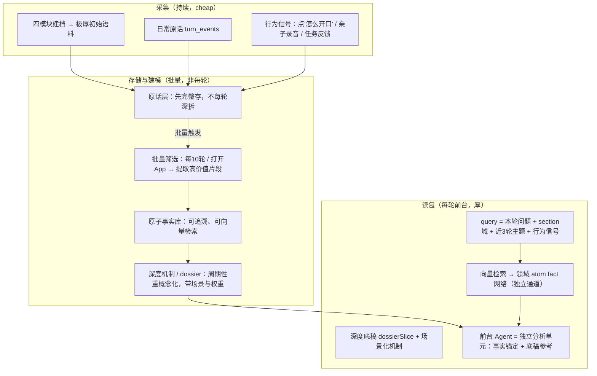

# 育见 · 产品记忆架构总纲（refined）

> Trae 2026-07-22 产出。基于用户产品愿景口述 + 三轮代码实证（写入链 / 读取链 / prompt cache）。
> 本文档是「应该长什么样」的产品架构总纲，凌驾于 [dossier-v3-fullchain-audit-and-improvement-plan.md](file:///Users/mac/Desktop/育见-2/.trae/documents/dossier-v3-fullchain-audit-and-improvement-plan.md)（「接上了没」的工程审计）之上。工程审计的 P0 断点仍然有效，但本文档定义了更高一层的架构方向。

---

## Part 0 · 与之前文档的关系

| 文档 | 层次 | 回答的问题 | 状态 |
|---|---|---|---|
| `dossier-v3-fullchain-audit-and-improvement-plan.md` | 工程 P0 | dossier 链路接上了没？PORTRAIT_V3 开了没？ | ✅ 仍有效，是本文档 Layer 0 的执行清单 |
| **本文档** | 产品架构 | 原话怎么存、什么时候拆、前台靠什么分析细场景、后台机制怎么演进 | 🆕 凌驾其上 |

一句话：工程审计解决「管道通不通」，本文档定义「水流该怎么走」。

---

## Part 1 · 产品愿景（用户原话提炼）

### 核心链路



### 两条铁律（用户反复强调）

**铁律 1 — 后台深度机制**
- 持续更新，不静态；带 `sceneReading`（场景配比）+ 权重 + `confidence` + 反证降级
- 禁止三条固定模板循环（如"拖延=保护控制"复读）
- 更新触发 = 批量高价值 atom 入库 + counter_evidence + prediction_failed，**不是每轮空转**

**铁律 2 — 前台 Agent**
- 喂的是 **query 域检索的 atom fact 网络 + dossier/机制底稿**，不是死画像
- SP 强制「事实锚定回答」：回答前引用 ≥2 条本家庭 atom；缺则说"这块我还需要更多场景"而非套机制
- 前台是独立分析单元，不是 digest 播音器；atom 与机制矛盾时以 atom 为准并说明差异

### 为什么是双引擎而非"大后台小前台"

用户原话："后台画像它是一个高度概括的、高度浓缩的一个机制，他不一定能够解释这个事情……真正的解释还是要依靠充足的这个事实的部分。"

- **后台**：慢更新、高压缩、提供稳固底稿（dossier + 场景化机制）——回答"这个家庭整体是什么样"
- **前台**：快响应、重事实、针对细场景综合判断——回答"此刻这个具体问题怎么办"
- 100 条作业相关 atom + 1 段 dossier 底稿 → 前台综合出"这个孩子周三作业前为什么拖延"——这绝不是 3 条抽象机制能解释的

---

## Part 2 · 现状对照（代码实证后的诚实话）

### 2.1 写入链：episode_ingest 每轮深拆（与铁律 1 冲突）

| 环节 | 现状（代码实证） | 与愿景的差距 |
|---|---|---|
| 原话存储 | `turn_events` + `getMergedParentInputHistory(100)` 已在存原话 | ✅ 存有了 |
| 每轮深拆 | [app/api/daily/stream/route.ts:151-158](file:///Users/mac/Desktop/育见-2/app/api/daily/stream/route.ts#L151-L158) 每轮有效非寒暄输入立即 `enqueueJob('episode_ingest')` | ❌ **与"不要每轮深拆"冲突** |
| episode_ingest 做什么 | [episode/pipeline.ts:73-183](file:///Users/mac/Desktop/育见-2/src/lib/server/memory/episode/pipeline.ts#L73-L183) 调 LLM `episodeExtractor` 现场拆 1 Episode + N Atoms + 向量编码 | ❌ 每轮 1 次 LLM 调用 + N 次 embedding，成本高 |
| memory_write 批量 | [batched-daily-write.ts:63-106](file:///Users/mac/Desktop/育见-2/src/lib/server/memory/write/batched-daily-write.ts#L63-L106) 满 10 轮或反证轮或登录补 flush | ✅ **这层已经是批量，符合愿景** |
| deep_mechanism 触发 | 6 路入队（turn_milestone / login / episode_ingest debounce / prediction_failed / build_complete / forceFull） | ⚠️ episode_ingest handler 链式用 15min debounce key，非 evidence 指纹去重——[s2-flags.ts:33-38](file:///Users/mac/Desktop/育见-2/src/lib/server/memory/deep-mechanism/s2-flags.ts#L33-L38) 注释与实现不一致 |

**关键发现**：用户说的"10-in-1 每轮深拆没意义"——代码里 **memory_write 已经是 10 轮批量**，但 **episode_ingest 仍是每轮深拆**。真正的低效点在 episode_ingest，不在 memory_write。

### 2.2 读取链：atom 无独立通道，被打平混进 supportingEvidence（与铁律 2 冲突）

| 环节 | 现状（代码实证） | 与愿景的差距 |
|---|---|---|
| atom 打包通道 | [router.ts:140-158](file:///Users/mac/Desktop/育见-2/src/lib/server/memory/retrieval/router.ts#L140-L158) episode 内高价值 atom + 跨 episode 高价值 atom 的 content 被**打平、丢弃 sourceType、混进 supportingEvidence**（与 episode summary 共享 string[]，前8+前7去重截15） | ❌ **无"按问题域独立通道"**，用户要的"100 条作业相关事实网络"不存在 |
| 检索 query 构成 | [pipeline.ts:231](file:///Users/mac/Desktop/育见-2/src/lib/server/orchestration/pipeline.ts#L231) 只用 `input.userText`；[episode-retriever.ts:55-67](file:///Users/mac/Desktop/育见-2/src/lib/server/memory/retrieval/episode-retriever.ts#L55-L67) embedText(query) + autoTagQuery(query) 关键词打标签 | ❌ **未拼接 section 类型 / 近3轮主题 / 行为信号** |
| entryFacts 通道 | [router.ts:179-194](file:///Users/mac/Desktop/育见-2/src/lib/server/memory/retrieval/router.ts#L179-L194) 来自四模块 decomposedInput（verifiableFacts/childBehaviors/...），厚包上限 80 | ✅ 是独立通道，但**来源是建档静态事实，不是日常对话 atom** |
| dossierSlice vs matchedMechanisms | [frontend-read-pack.ts:14-15](file:///Users/mac/Desktop/育见-2/src/lib/server/daily/frontend-read-pack.ts#L14-L15) 并列 top-level；[prose-context.ts:93-96](file:///Users/mac/Desktop/育见-2/src/lib/server/daily/prose-context.ts#L93-L96) dossierSlice 主源、matchedMechanisms 兜底 | ✅ 结构对 |
| hidden section 丢 pack | [parent-facing-copy.ts:106-117](file:///Users/mac/Desktop/育见-2/src/lib/server/daily/parent-facing-copy.ts#L106-L117) dossierSlice 非空时只传 dossierSlice+digest+userText | ❌ **dossier 越厚，atom 事实锚点越少**——悖论 |
| how-to-speak 漏 dossierSlice | [how-to-speak/route.ts:103-137](file:///Users/mac/Desktop/育见-2/app/api/daily/how-to-speak/route.ts#L103-L137) `packetToRetrievedContext` 未传 dossierSlice 字段 | ❌ **how-to-speak 链路 dossierSlice 恒为空**（新发现，之前审计未覆盖） |

### 2.3 prompt cache：键序声明与实现有偏差，session cache 是 dead code

| 层 | 现状（代码实证） | 命中情况 |
|---|---|---|
| L0 system 身份 §A+§C | [modeling-identity.ts:37-44](file:///Users/mac/Desktop/育见-2/src/lib/server/prompts/modeling-identity.ts#L37-L44) 跨所有 Agent 稳定 | ✅ 高命中 |
| L1 Agent SP | [ark-agents.ts:101-104](file:///Users/mac/Desktop/育见-2/src/lib/server/ark-agents.ts#L101-L104) 该 Agent 跨请求稳定 | ✅ 高命中 |
| L2 THEORY_CARDS | [pipeline.ts:474-482](file:///Users/mac/Desktop/育见-2/src/lib/server/memory/deep-mechanism/pipeline.ts#L474-L482) + [L524-532](file:///Users/mac/Desktop/育见-2/src/lib/server/memory/deep-mechanism/pipeline.ts#L524-L532) system suffix（theoryMatcher/portraitSynthesizer） | ✅ 多 Agent 链命中；❌ [L322-330](file:///Users/mac/Desktop/育见-2/src/lib/server/memory/deep-mechanism/pipeline.ts#L322-L330) legacy monolith **不注入**（新发现） |
| L3 retrievalPack 11 键 | [frontend-read-pack.ts:11-23](file:///Users/mac/Desktop/育见-2/src/lib/server/daily/frontend-read-pack.ts#L11-L23) 声称"稳定前缀在前" | ❌ **dossierSlice 排第 4 位且每轮按 query 切片必变** → 从第 4 键起全 miss（新发现，之前审计未覆盖） |
| L4 session 复用 | [retrieval-session-cache.ts](file:///Users/mac/Desktop/育见-2/src/lib/server/memory/retrieval-session-cache.ts) 已实现 3 个函数 | ❌ **全仓库无调用点，dead code**；[pipeline.ts:228-230](file:///Users/mac/Desktop/育见-2/src/lib/server/orchestration/pipeline.ts#L228-L230) 明确每轮重跑检索 |

**关键发现**：用户想用 prompt cache 放大注入——代码里键序声明对了、session cache 写了，但 **dossierSlice 排位破坏前缀 + session cache 没接线**，两层都没落地。

### 2.4 数据库（用户提醒：勿强行参考）

- 34 家庭、0 dossier、测试垃圾语料——**不能拿现网统计反推产品对不对**，只能看链路设计是否符合总纲
- 服务器实测的 336 字 mechanismNarrative 证明 AI 能产出有质量内容，只是 dossier 整合框架被 flag 关着

---

## Part 3 · 架构设计：回答两个核心问题

### Q1：细场景下，怎么避免前台空泛 / 套机制？

要同时动**读包、SP、后台机制、验收**四层，单改一层不够。

#### ① 读包：atom 必须有"按问题域独立通道"

现状 atom 被打平混进 supportingEvidence（15 条，与 episode summary 混排）。改为：

- 新增 `domainAtomFacts: string[]` 作为 FrontendReadSchema 第 12 键，与 dossierSlice / matchedMechanisms **并列**
- 来源：[episode-retriever.ts](file:///Users/mac/Desktop/育见-2/src/lib/server/memory/retrieval/episode-retriever.ts) 已返回 `extraHighValueAtoms`（跨 episode 高价值 atom）+ episode 内 atoms——router 不要打平，按 sourceType 分流，高价值 atom 进 domainAtomFacts
- 厚包上限：参考 entryFacts 的 80 条，domainAtomFacts 设 40–60 条（按 query 域检索，不是全量）
- 检索 query 拼接：`section类型 + 近3轮主题 + 行为信号（点了"怎么开口"）+ 家长本轮文本`，不要只用 userText

#### ② SP：从"解释机制"改成"用事实回答这个具体问题"

前台 SP（[parentFacingStyle.md](file:///Users/mac/Desktop/育见-2/prompts/core/parentFacingStyle.md) / [parentFacingCopy.md](file:///Users/mac/Desktop/育见-2/prompts/front/parentFacingCopy.md) / [dailyDialogueOrchestration.md](file:///Users/mac/Desktop/育见-2/prompts/front/dailyDialogueOrchestration.md)）加硬规则：

- 回答前必须引用 ≥2 条**本家庭** atom（原话或可追溯事实）；缺则写"这块我还需要更多具体场景"而非套机制
- `matchedMechanisms` / `dossierSlice` 只作**背景假设**，禁止当回答主体
- atom 与机制矛盾时，**以 atom 为准并说明差异**（如"机制判断拖延=保护控制，但你提到周三是他主动求助的那天，这次可能不是逃避"）
- section 专用 SP 与主 prose 同一套"事实优先"纪律，hidden 路径不能变瘦

#### ③ 后台机制：带 sceneReading，不是固定三条 loop

后台给前台的机制不应是"拖延=保护控制"一条公式，而应是：

> 在【周三作业前】常出现 X（confidence 0.8）；在【周末兴趣】又出现 Y（confidence 0.5）——权重随场景变。

对应 dossier 的 `sceneReadings` 字段（已在 [portraitSynthesizer.md](file:///Users/mac/Desktop/育见-2/prompts/background/portraitSynthesizer.md) 设计里）。关键是**写进 SP 和 reviewer 的硬约束**，不是只写在 theory card 注释。

#### ④ 验收：replay 抽检反套模板

- 细场景问题是否出现具体原话 / 具体时间地点
- 连续 3 轮输出同一 mechanism 句式 → 判 fail
- 这比"AI 总结三个写作业机制反复套"更可自动化

### Q2：后台深度机制该怎么写？写细？分场景？怎么更新？

**后台不是写得更细来替代前台，而是写"可演进的结构化底稿"。**

| 层级 | 职责 | 更新节奏 | 给前台什么 |
|---|---|---|---|
| **Atom fact** | 可追溯原话/事实 | 批量（10 轮 / 打开 App） | 向量检索，域相关大量注入（domainAtomFacts） |
| **Mechanism matrix** | 带 sceneReading、权重、confidence | counter_evidence / 批量 review | 3–6 条**场景化**机制摘要，非模板句 |
| **Dossier** | 理论隐身的整合叙述 | portraitSynthesizer 周期性 | `dossierSlice` 按 query 切 |
| **Hypotheses** | 待验证假设 | 新 atom 冲突时升/降 | `pendingHypotheses` 驱动"还不确定"表述 |

**不要**：把 mechanism 写成固定三条 homework loop，前台每次复读。

**要**：
1. **分场景写机制**（sceneReading）——同一行为不同情境 protective 配比不同
2. **有权衡、有权重、有版本**：新 atom 与旧判断冲突 → `model_review` / counter_evidence 触发**更新权重或降级**，不是覆盖或无视
3. **周期性重概念化**，不是每轮：`portraitSynthesizer` 读近 N 条高价值 atom + 旧 dossier → 输出新版；前台每轮只读 slice + 检索 atom，不算全量 dossier

一句话：**后台 = 慢更新的"家庭理论底稿"；前台 = 快响应的"事实 + 底稿综合分析师"。双引擎。**

---

## Part 4 · 写入链改造（批量筛选，非每轮深拆）

### 现状问题

[app/api/daily/stream/route.ts:151-158](file:///Users/mac/Desktop/育见-2/app/api/daily/stream/route.ts#L151-L158) 每轮有效非寒暄输入立即 `enqueueJob('episode_ingest')`，[episode/pipeline.ts:73-183](file:///Users/mac/Desktop/育见-2/src/lib/server/memory/episode/pipeline.ts#L73-L183) 调 LLM 现场拆 1 Episode + N Atoms + 向量编码。

用户原话："每次用户输入都去重复地调用一次其实很麻烦……每10轮或者每次用户打开的时候，我们直接把近10次近20次的这个原话统一地按照我们的思路进行一次筛选。"

### 目标

```
原话 cheap 存 turn_events（已有）
  → 批量触发（10轮 / 打开App / 反证轮）
    → episode_ingest 批量深拆（1次 LLM 拆 N 条原话 → N Episodes + M Atoms）
      → deep_mechanism_review（已有，周期性重概念化）
```

### 改造点

1. **route.ts 不再每轮 enqueueJob('episode_ingest')**：改为暂存到 `pending_episode_buffer`（类似 batched-daily-write 的暂存层）
2. **批量触发点**：
   - 满 10 轮有效交流（与 `noteEffectiveFamilyTurn` 的 10 轮里程碑对齐）
   - 登录打开 App（与 `forceLoginJobCheck` 对齐）
   - 反证轮立即 flush（与 `forceFlush = relType === 'counter_evidence'` 对齐）
3. **episode_ingest handler 改批量**：`ingestEpisodeStrict` 接收 `text[]` 而非 `text`，1 次 LLM 调用拆多条原话
4. **保留 turn_events 原话存储**：原话仍每轮存（cheap），只是不每轮深拆

### 风险

- 批量深拆的 LLM prompt 更长（多条原话），单次成本上升但总成本下降
- 反证轮需立即 flush，不能等 10 轮——已有 `forceFlush` 机制可复用
- 向量编码仍需逐条 embed（不可批量），但 embedding 比 LLM 便宜得多

### 预期收益

- LLM 调用次数降 ~10×（每 10 轮 1 次而非 10 次）
- atom 质量提升（批量看 10 条原话，能识别重复模式和跨轮关联，而非单轮盲拆）
- deep_mechanism_review 的 episode_ingest debounce 不再高频空转

---

## Part 5 · 读取链改造（双引擎前台）

### 5.1 atom 独立通道 domainAtomFacts

- [router.ts:140-158](file:///Users/mac/Desktop/育见-2/src/lib/server/memory/retrieval/router.ts#L140-L158) 不要把 atom content 打平进 supportingEvidence
- 新增 `domainAtomFacts` 键，保留 sourceType（child_quote / material_observation / counter_evidence / feedback），让 SP 能区分"孩子原话"vs"家长陈述"vs"反证"
- [frontend-read-pack.ts](file:///Users/mac/Desktop/育见-2/src/lib/server/daily/frontend-read-pack.ts) FrontendReadSchema 加第 12 键，厚包上限 40–60

### 5.2 检索 query 拼接

[pipeline.ts:231](file:///Users/mac/Desktop/育见-2/src/lib/server/orchestration/pipeline.ts#L231) 的 `buildDailyDialogueRetrievalPacket(input.userText, ...)` 改为：

```
query = [section类型] + [近3轮主题] + [行为信号] + input.userText
```

- section 类型：hidden / how-to-speak / daily prose
- 近 3 轮主题：从 `getMergedParentInputHistory(3)` 提取
- 行为信号：用户点了"我想学怎么开口" / 用了亲子录音 / 任务反馈

### 5.3 hidden section 不丢 pack

[parent-facing-copy.ts:106-117](file:///Users/mac/Desktop/育见-2/src/lib/server/daily/parent-facing-copy.ts#L106-L117) dossierSlice 非空时改为保留 retrievalPack 关键子集（domainAtomFacts 前 5 + childQuotes 前 3 + parentVerbatimSnippets 前 3），而非只传 dossierSlice。

### 5.4 how-to-speak 补 dossierSlice

[how-to-speak/route.ts:103-137](file:///Users/mac/Desktop/育见-2/app/api/daily/how-to-speak/route.ts#L103-L137) 的 `packetToRetrievedContext` 补 dossierSlice 字段——这是之前审计未覆盖的新断点。

---

## Part 6 · prompt cache 策略（放大注入）

### 6.1 键序重排：dossierSlice 下移

[frontend-read-pack.ts:11-23](file:///Users/mac/Desktop/育见-2/src/lib/server/daily/frontend-read-pack.ts#L11-L23) 现状 dossierSlice 排第 4，但每轮按 query 切片必变，破坏前缀。建议重排：

```
稳定前缀区（家庭级不变 / 慢变）：
  1. childStructureModels
  2. entryEvidence
  3. matchedMechanisms      ← 上移（mechanism matrix 稳定）
  4. familyPatterns
  5. parentUnderstanding
  6. pendingHypotheses
  7. childQuotes
  8. entryFacts             ← 慢变但有增长，放中后段
动态后缀区（每轮变）：
  9. domainAtomFacts        ← 新增，按 query 域检索必变
  10. dossierSlice          ← 下移（每轮按 query 切）
  11. recentEvents
  12. parentVerbatimSnippets
```

收益：前 8 键稳定，user payload 前缀能命中 DeepSeek cache；dossierSlice / domainAtomFacts 变化只影响尾部。

### 6.2 session cache 接线（带漂移检测）

[retrieval-session-cache.ts](file:///Users/mac/Desktop/育见-2/src/lib/server/memory/retrieval-session-cache.ts) 已实现 `mergeIncrementalRetrievalPacket`（只刷新 recentRelatedEvents，其余 10 键复用首轮 packet）——但全仓库无调用点。

[pipeline.ts:228-230](file:///Users/mac/Desktop/育见-2/src/lib/server/orchestration/pipeline.ts#L228-L230) 明确每轮重跑，理由"话题切换后会锁死首轮证据"——这是正确顾虑。

**折中方案**：接线 session cache + 加**主题漂移检测**——本轮 query embedding 与首轮 query embedding 相似度 < 阈值（如 0.6）时失效 cache 并重跑，否则复用。这样既省 cache 又不锁死话题。

### 6.3 legacy monolith 补 THEORY_CARDS

[pipeline.ts:322-330](file:///Users/mac/Desktop/育见-2/src/lib/server/memory/deep-mechanism/pipeline.ts#L322-L330) 的 `runLegacyMonolith` 不传 systemSuffix，应补 THEORY_CARDS，与多 Agent 链对齐。

### 6.4 预期效果

- dossier 全文 + mechanism matrix 格式化块进 cache 前缀（家庭级，随 deep_mechanism_review 更新才变）
- 某次对话内"作业域 atom 包"在首 section 检索后复用（session 级）
- 动态层仅 userText + 本轮 query delta
- 大量 atom 原文塞进 SP，而不每轮重复烧 full token

---

## Part 7 · 全功能记忆契约

每个功能的 BFF 入参都要有 **`retrievalPack`（厚）+ `deepModelDigest/dossierSlice`（底稿）**；SP 写清"先事实后概括"；产出须**写回**可被下轮读到的层（atom / hypothesis / cycle）。

| 功能 | 应读什么 | 现状 | 应写回什么 | SP 纪律 |
|---|---|---|---|---|
| **录音转写分析** | transcript atoms + 亲子互动 cycles + 孩子语气 | `materialUnderstanding` → episode 链有 | 分析结论回写 atom / cycle，进入下次检索 | 结论须锚定 transcript 原话 |
| **手账** | episode 02 = 场景+原话，Top3 可读 | 02 准入有 gate，enrich 可能学术标题 | 手账条目 = 记忆入口，非展示 digest 摘要 | 条目锚定本家庭原话 |
| **预演** | scenes 从对话动态长 + handoff retrievalPack + dossierSlice | end 页已接；L3 仍硬编码；handoff 半断；how-to-speak 漏 dossierSlice | 对话分析回写 atom / hypothesis | 场景 brief、opening 须读 atom + dossier slice |
| **Section / hidden** | 同 daily：机制 + 域 atom | hidden payload bug（丢 pack） | — | 修 bug + section query 独立检索 |
| **怎么开口** | 该场景 child_quote + 家长开口历史 + cycles | how-to-speak 漏 dossierSlice | 生成的句式回写为 parentVerbatim 候选 | 句式锚定本家庭原话，非通用话术 |
| **任务生成** | focus 卡 + pendingHypotheses + 最近 atom | task 链有 digest 引用 | 任务 = 待验证假设的操作化 | 任务锚定 hypothesis，非通用 todo |
| **待观察点 / 画像** | growth 六维 + 跨场景 atom | dailyPortraitRefresh SP 已要求多维 | UI 须消费 hub 全字段 | Hero/卡片读 snapshot，不能硬编码 |

**共同纪律**：不能单向"读一下 digest"就完——产出必须写回可被下轮读到的层，形成闭环。

---

## Part 8 · 两条铁律 + 验收标准

### 铁律 1 — 深度机制持续更新

- ✅ sceneReading + 权重 + confidence + 反证降级
- ✅ 禁止三条 homework 模板循环
- ✅ 更新触发 = 批量高价值 atom 入库 + counter_evidence + prediction_failed
- ❌ 不每轮空转

**验收**：
```sql
-- 机制矩阵是否场景化（同一行为不同情境有不同权重）
SELECT family_id, jsonb_array_length(data->'candidateMechanismMatrix') AS mech_n
FROM memory_layer_items WHERE layer_name='evidence_networks' LIMIT 10;
-- 期望：mech_n 平均 >= 5，且每条 mechanism 带 sceneReadings

-- dossier 是否有 predictions（可证伪）
SELECT family_id, jsonb_array_length(data->'dossier'->'workingHypothesis'->'predictions') AS pred_n
FROM memory_layer_items WHERE layer_name='deep_model_digest' AND data ? 'dossier' LIMIT 10;
-- 期望：pred_n >= 1
```

### 铁律 2 — 前台 Agent 事实锚定

- ✅ 喂 query 域检索 atom fact 网络 + dossier/机制底稿
- ✅ SP 强制"事实锚定回答"：≥2 条本家庭 atom
- ✅ atom 与机制矛盾时以 atom 为准
- ✅ 前台是独立分析单元
- ❌ 不靠死画像硬套

**验收**：
- replay 抽检：细场景问题是否出现具体原话 / 具体时间地点
- 连续 3 轮输出同一 mechanism 句式 → 判 fail
- SP 回答里 atom 引用率 ≥ 80%（可统计 prompt 里 atom 出现次数）

---

## Part 9 · 落地优先级

### Layer 0 · 工程 P0（立即，1-2 天）

见 [dossier-v3-fullchain-audit-and-improvement-plan.md](file:///Users/mac/Desktop/育见-2/.trae/documents/dossier-v3-fullchain-audit-and-improvement-plan.md) Layer 1：
- L0-1：开 `PORTRAIT_V3=1`
- L0-2：修 hidden section 丢 pack
- L0-3：修 daily handoff
- L0-4：修预演 end 硬编码
- L0-5：修建档结果页 Hero
- **L0-6（新）**：修 how-to-speak 漏 dossierSlice（本文档新发现）

### Layer 1 · 写入链批量改造（1 周）

- 改 route.ts 不再每轮 enqueueJob('episode_ingest')，改暂存
- 改 episode_ingest handler 接批量 text[]
- 与 10 轮里程碑 / 登录 flush / 反证轮对齐
- **对应铁律 1**：不每轮空转

### Layer 2 · 读取链双引擎改造（1-2 周）

- 新增 domainAtomFacts 独立通道
- 检索 query 拼接 section + 近3轮 + 行为信号
- hidden 不丢 pack
- SP 加事实锚定硬规则
- **对应铁律 2**：前台事实锚定

### Layer 3 · prompt cache 落地（1 周，可与 Layer 2 并行）

- 键序重排（dossierSlice 下移）
- session cache 接线 + 漂移检测
- legacy 补 THEORY_CARDS
- **对应**：放大注入，不膨胀成本

### Layer 4 · 后台机制演进（2-4 周）

- mechanism matrix 带 sceneReading + 权重
- THEORY_CARDS 补齐 exo/macro rich 字段
- dossier 质量评分
- freshness 感知降级
- **对应铁律 1**：机制不模板化

### Layer 5 · 全功能闭环（持续）

按 Part 7 表格逐个功能接记忆契约，每个功能：读厚 + 写回 + SP 纪律。

---

## Part 10 · 给执行者的分工建议

| 层 | 适合谁 | 理由 |
|---|---|---|
| Layer 0 | Cursor | 小而具体的断点修复 |
| Layer 1 | Cursor | route.ts + queue.ts + episode pipeline，代码改动明确 |
| Layer 2 | Trae | 涉及 schema 改造 + SP 改写，上下文长优势 |
| Layer 3 | Trae | cache 策略需整体理解键序+session cache+漂移检测 |
| Layer 4 | Trae + 心理学/教育学专家 | theory card 补齐需领域知识 |
| Layer 5 | Trae（SP/契约）+ Cursor（BFF/UI） | 按功能拆 |

---

## 附录 · 关键文件索引

| 文件 | 作用 | 本文档关注点 |
|---|---|---|
| [app/api/daily/stream/route.ts](file:///Users/mac/Desktop/育见-2/app/api/daily/stream/route.ts) | 每轮入口 | L151-158 episode_ingest 每轮深拆 |
| [src/lib/server/memory/episode/pipeline.ts](file:///Users/mac/Desktop/育见-2/src/lib/server/memory/episode/pipeline.ts) | episode 深拆 | L73-183 ingestEpisodeStrict |
| [src/lib/server/memory/write/batched-daily-write.ts](file:///Users/mac/Desktop/育见-2/src/lib/server/memory/write/batched-daily-write.ts) | 10轮批量 | L63-106 已是批量（符合愿景） |
| [src/lib/server/memory/retrieval/router.ts](file:///Users/mac/Desktop/育见-2/src/lib/server/memory/retrieval/router.ts) | 检索路由 | L140-158 atom 打平丢 sourceType；L179-194 entryFacts 独立通道；L243-247 dossierSlice/matchedMechanisms |
| [src/lib/server/memory/retrieval/episode-retriever.ts](file:///Users/mac/Desktop/育见-2/src/lib/server/memory/retrieval/episode-retriever.ts) | 三段式检索 | L55-108 extraHighValueAtoms 已有，router 未用 |
| [src/lib/server/daily/frontend-read-pack.ts](file:///Users/mac/Desktop/育见-2/src/lib/server/daily/frontend-read-pack.ts) | 11 键 schema | L11-23 键序需重排 |
| [src/lib/server/daily/parent-facing-copy.ts](file:///Users/mac/Desktop/育见-2/src/lib/server/daily/parent-facing-copy.ts) | hidden payload | L106-117 丢 pack |
| [src/lib/server/daily/prose-context.ts](file:///Users/mac/Desktop/育见-2/src/lib/server/daily/prose-context.ts) | prose payload | L93-96 dossierSlice 主源 |
| [src/lib/server/memory/retrieval-session-cache.ts](file:///Users/mac/Desktop/育见-2/src/lib/server/memory/retrieval-session-cache.ts) | session cache | dead code，需接线 |
| [src/lib/server/orchestration/pipeline.ts](file:///Users/mac/Desktop/育见-2/src/lib/server/orchestration/pipeline.ts) | 编排主链 | L228-230 每轮重跑检索 |
| [app/api/daily/how-to-speak/route.ts](file:///Users/mac/Desktop/育见-2/app/api/daily/how-to-speak/route.ts) | 怎么开口 | L103-137 漏 dossierSlice |
| [src/lib/server/memory/deep-mechanism/pipeline.ts](file:///Users/mac/Desktop/育见-2/src/lib/server/memory/deep-mechanism/pipeline.ts) | 深度机制 | L322-330 legacy 不注入 THEORY_CARDS；L474-482/L524-532 多 Agent 链注入 |
| [src/lib/server/memory/dossier/should-reconceptualize.ts](file:///Users/mac/Desktop/育见-2/src/lib/server/memory/dossier/should-reconceptualize.ts) | L2 触发 | L82-134 7 个 reason |
| [prompts/core/parentFacingStyle.md](file:///Users/mac/Desktop/育见-2/prompts/core/parentFacingStyle.md) | 前台核心 SP | 需加事实锚定硬规则 |
| [prompts/background/portraitSynthesizer.md](file:///Users/mac/Desktop/育见-2/prompts/background/portraitSynthesizer.md) | dossier 产出 SP | predictions 硬约束 + sceneReading |
