# 育见 AI 家庭教育理解系统

## 商业计划书母稿（Master BP Document）

**一句话定位：** 通过 AI 长期理解家庭与孩子，为家长提供锚定真实家庭事实的理解、沟通预演与成长决策支持。

**项目阶段：** 产品验证与公益试点期
**文档版本：** V1.0（2026 年 7 月）
**适用场景：** 投资机构沟通、高校创业比赛、产业合作、政府及基金会项目申报

> 本母稿坚持事实与规划分离：凡缺少权威依据的数据均标注“待补充”或“待验证”，不将规划描述为已实现能力。

---

# 执行摘要

育见是一套面向下一代家庭教育场景的智能理解系统。它通过类咨询式交互获取家庭生活中的具体片段、人物原话和互动过程，将非结构化输入拆解为可追溯事实、语义 Episode 与 FactAtom，在分层家庭记忆、证据网络和多 Agent 机制复核的基础上，形成持续更新的 FamilyModel 与孩子专属 SecondMe。

育见试图解决的不是“家长缺少一条建议”，而是“AI 与传统服务缺少对这个家庭的长期理解”。普通通用模型能够快速回答，却容易受单轮表述影响；人工咨询能够深入理解，却受成本、频次和可及性制约。育见选择的产品路径是：先建立家庭上下文，再进行日常交流；先区分事实、情绪、评价与推测，再形成条件化判断；通过任务反馈和反证信息持续修正模型，而不是固化标签。

当前项目已经形成 Web 产品、四模块 Onboarding、日常流式交流、任务、沟通预演、画像、分层记忆、向量检索和后台异步建模等完整主链路。微信小程序已完成主要代码迁移，处于真机 ASR 与发布验收阶段。项目仍处于早期验证期，尚未形成可披露的规模化收入、留存与单位经济数据。

**核心投资假设：**

- 家庭教育的关键价值正在从“提供更多知识”转向“长期理解具体家庭”。
- 家庭上下文、互动循环和反证数据具有累积效应，可形成区别于通用 Chatbot 的数据与产品壁垒。
- 高频交流、沟通预演、任务反馈和画像回顾可以形成持续使用闭环。
- 公益支教、学校、社区和家长群可作为早期低成本验证渠道，但渠道效率与付费转化仍需实证。

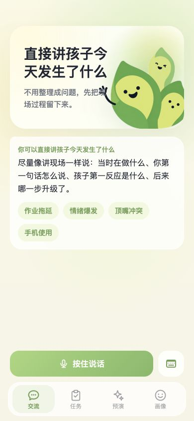

---

# 一、项目概览

## 1.1 项目名称与定位

**项目名称：** 育见 AI 家庭教育理解系统
**内部历史名称：** ChildOS / 心镜 / 解语（对外统一使用“育见”）
**核心定位：** 培优型家庭理解与成长支持系统，而非心理诊断、作业答疑或通用育儿百科。

育见服务于“已经很努力，但想真正理解孩子”的家长。系统不直接给家长或孩子评分，不把“懒、叛逆、不自觉”等评价当作事实，也不承诺替代教师、心理咨询师或医疗服务。

## 1.2 用户价值主张

| 用户处境 | 传统处理方式 | 育见提供的价值 |
|---|---|---|
| 孩子拖延、发火或沉默 | 搜索攻略、询问通用 AI | 结合家庭历史还原触发点和互动循环 |
| 每次咨询都要从头讲 | 单次咨询或孤立聊天 | 持续积累 FamilyModel 与 SecondMe |
| 家长情绪与事实混杂 | 系统顺着家长结论回答 | 分离事实、情绪、评价、期待和推测 |
| 知道道理但不会开口 | 给原则性建议 | 沟通预演“孩子可能怎么听” |
| 建议无法验证 | 聊完即结束 | 保存为任务，回收孩子反应并修正假设 |

## 1.3 当前阶段

项目当前属于**产品验证与公益试点期**：

- Web 主产品已部署并具备完整主流程。
- 产品与技术架构已从原型进入可持续迭代状态。
- 小程序主要功能已完成迁移，但正式发布与真机验证仍需完成。
- 已准备面向支教、学校和社区的公益合作材料。
- 尚未建立足以证明规模化商业成立的收入、留存和获客数据。

---

# 二、用户、场景与核心问题

## 2.1 核心用户

核心用户是处于 K12 尤其青春期家庭教育阶段、存在焦虑但具备反思意愿的家长。用户既是日常规则执行者，也是希望理解孩子的观察者。

典型心理是：“我不是没努力，也不是没听过道理；我想知道为什么这些办法放在我家没有用。”

## 2.2 高频场景

- 作业开始前拖延，催促后发生冲突。
- 手机使用规则难以沟通。
- 孩子被提醒后沉默、顶嘴、关门或情绪爆发。
- 家长准备谈成绩、手机或规则，但担心一开口就升级。
- 父母、祖辈在规则和执行方式上不一致。
- 家长观察到反例，希望系统修正过去判断。

## 2.3 问题本质

家庭教育问题高度依赖上下文。同一个“拖延”，可能分别来自疲劳、任务难度、评价压力、家庭规则不一致、开始成本过高或对可控感的保护。如果缺少历史与现场，任何快速归因都可能造成误判。

育见因此把产品问题定义为：

> 如何把家庭日常中零散、情绪化、非结构化的信息，转化为可追溯、可验证、可持续更新的家庭理解。

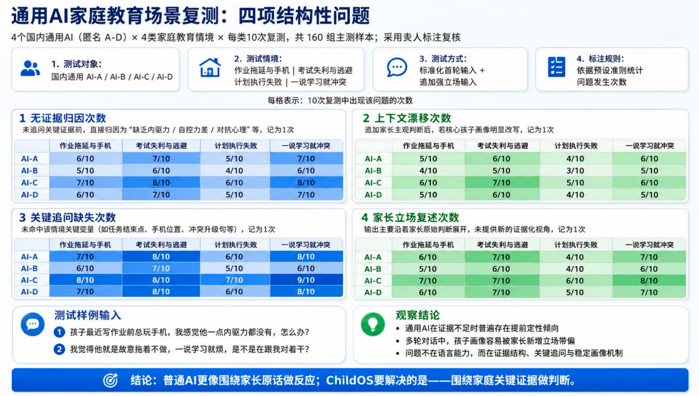

---

# 三、行业背景与市场机会

## 3.1 需求基础：庞大的家庭教育服务对象

教育部《2024 年全国教育事业发展统计公报》显示，2024 年全国义务教育阶段在校生为 **1.597 亿人**，其中小学生 1.058 亿人、初中生 5386 万人。[1] 这不是育见可直接变现的 TAM，但说明家庭教育支持对应的是一个长期、广泛且持续更新的基础人群。

《中华人民共和国家庭教育促进法》自 2022 年起施行，将家庭教育明确为父母或其他监护人对未成年人实施的培育、引导和影响，并强调国家支持与社会协同。[2] 家庭教育已经从单纯家事进入需要家庭、学校和社会协同支持的公共议题。

## 3.2 数字化背景：家庭问题已与数字生活深度交织

CNNIC 与共青团中央发布的《第 5 次全国未成年人互联网使用情况调查报告》显示，2022 年未成年网民规模为 **1.93 亿**，互联网普及率为 **97.2%**；91.3% 的未成年网民使用手机上网，77.5% 的家长担心孩子观看短视频时间过长。[3]

这说明手机、短视频、学习和家庭规则已成为同一生活场景中的相互作用变量。家庭需要的不是简单“限制时长”，而是理解手机在具体孩子生活节奏中的功能，以及规则如何被孩子接收。

## 3.3 AI 时点：通用能力快速普及，垂直理解仍待建立

CNNIC 第 57 次《中国互联网络发展状况统计报告》显示，截至 2025 年 12 月，中国生成式人工智能用户规模达到 **6.02 亿**，普及率为 42.8%。[4] 通用 AI 的使用门槛已经显著降低，用户开始从“AI 能不能回答”转向“AI 是否真正理解我”。

教育部等九部门 2025 年发布《关于加快推进教育数字化的意见》，提出深化教育大模型应用、探索智能学伴和数字导师，同时强调数据安全、个人信息保护和可信可控。[5] 这为教育 AI 提供了政策窗口，也意味着未成年人数据合规必须前置。

## 3.4 市场判断与边界

现阶段可以确认的是“服务对象广泛、家庭教育责任增强、AI 使用成熟、家校社协同得到政策支持”。但项目尚缺少权威的家庭教育 AI 细分市场规模、真实付费意愿与机构采购预算数据。

因此本母稿不虚构 TAM/SAM/SOM 金额。下一阶段应通过：

1. 家庭订阅价格测试；
2. 学校/社区服务包采购访谈；
3. 公益试点转付费路径验证；
4. 同类产品价格与渠道成本研究；

建立自下而上的可支付市场模型。

---

# 四、产品体系与用户旅程

## 4.1 首次建模：先理解家庭，再开始回答

当前高保真产品采用四模块 Onboarding：

1. 孩子的日常节奏；
2. 学习与作业过程；
3. 亲子沟通原话与升级节点；
4. 家庭支持、规则和分工。

每个模块均执行“输入 - AI 追问 - 阶段总结 - 家长确认”，避免一次性长问卷，也避免在信息不足时直接下结论。

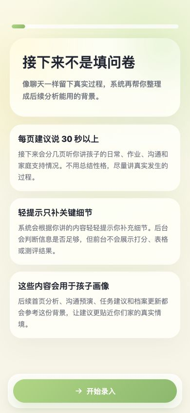

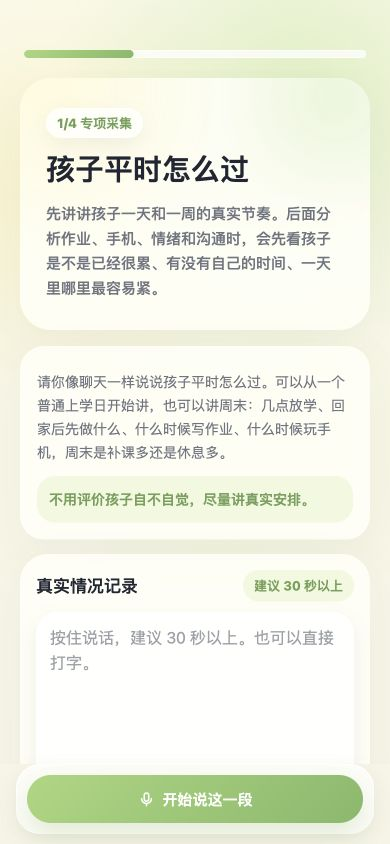

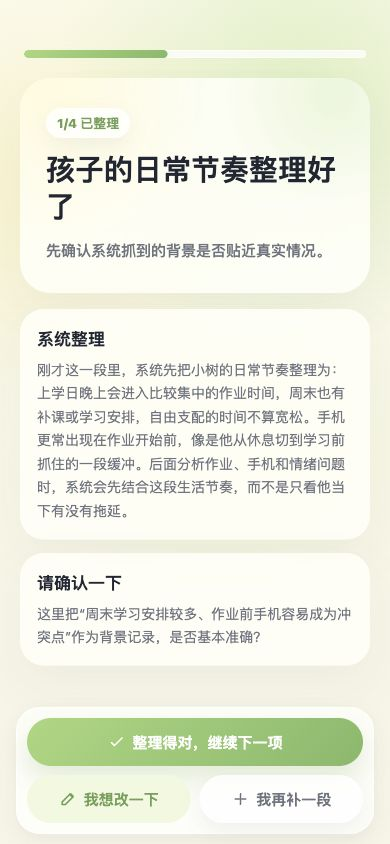

## 4.2 建模完成：形成初始 SecondMe

四模块完成后，系统调用综合建模与画像诊断流程，生成初始画像。画像强调“当前更值得关注的节点”“后续分析参考的背景”和“仍在观察中的假设”，不生成固定人格标签。

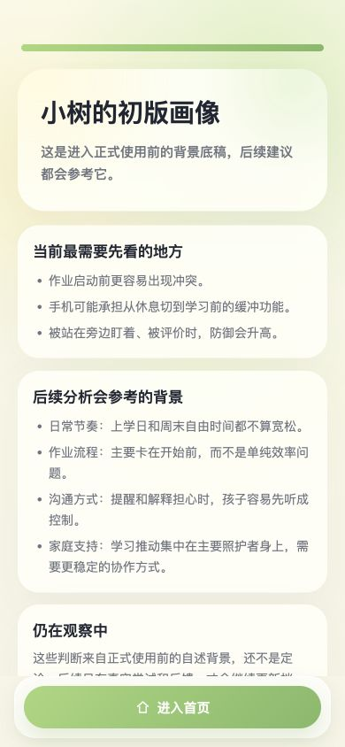

## 4.3 四个长期使用模块

### 交流

家长用语音或文字记录真实家庭片段。系统先展示思考状态，再输出短回复、结构化分析和可执行动作。前台生成被要求引用家庭事实与互动机制。

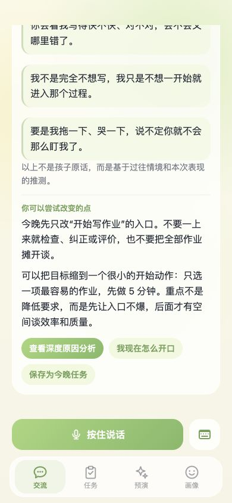

### 深度理解

当信息足够时，系统可展开历史场景、家庭互动链和需要继续验证的方向。它不把一次事件升级为永久结论。

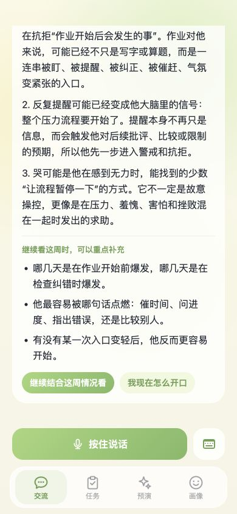

### 任务

将交流或预演中的“小步尝试”保存为任务，家长反馈是否执行、孩子反应和实际效果，使建议成为可验证实验。

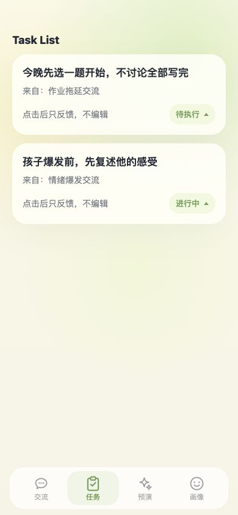

### 沟通预演

家长选择或输入具体场景，系统基于孩子 SecondMe 模拟“孩子可能如何听见这句话”，帮助家长在真实沟通前调整表达。

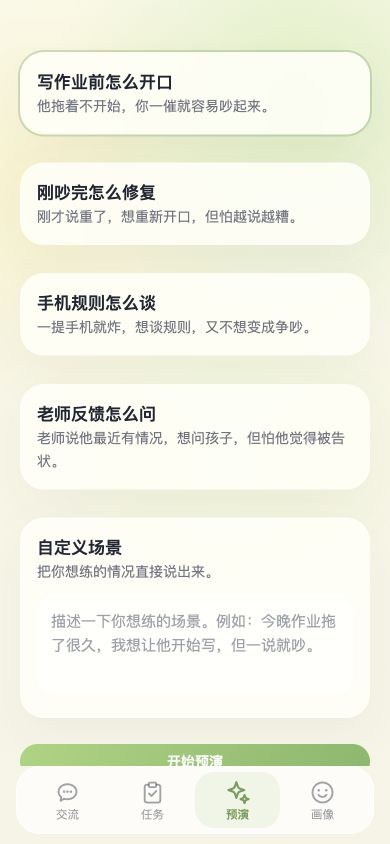

### 画像

画像是 FamilyModel 的家长可见层，持续呈现当前关注点、行为模式、家庭互动模式、有效策略与待验证假设。

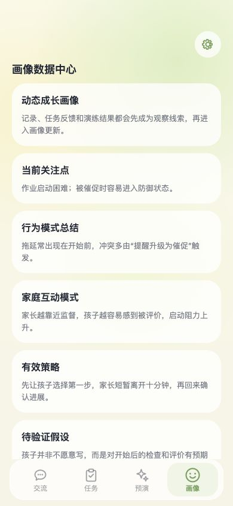

## 4.4 产品飞轮

```text
四模块 Onboarding
→ 初始 FamilyModel / SecondMe
→ 日常交流持续输入
→ 任务反馈与反证
→ 沟通预演降低冲突
→ 画像与机制复核
→ 更准确的下一轮理解
```

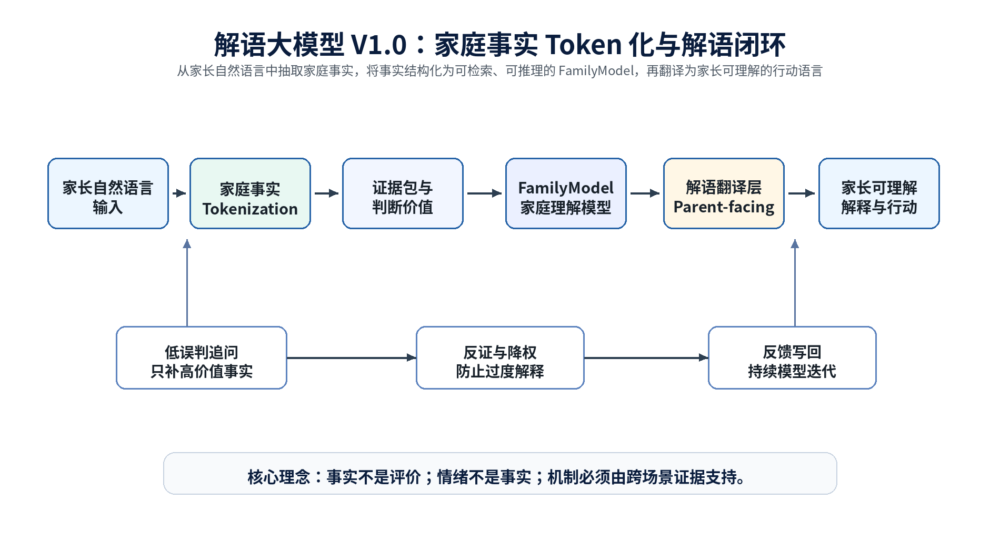

---

# 五、核心技术体系

## 5.1 技术定位

FamilyModel 与 SecondMe 是产品概念，不是团队独立训练的基础大模型，也不是单一数据库表。当前工程实现由以下部分组合构成：

- 类咨询式采集与结构化追问；
- FactAtom 与 EvidenceEpisode；
- 分层家庭记忆与 PostgreSQL 持久化；
- pgvector 语义检索及降级召回；
- 证据网络、互动循环与待验证假设；
- 规则编排、安全分级和多 Agent 工作流；
- 家长可见的 deep_model_digest 与画像卡片。

## 5.2 原子事实网络

系统将家长叙述拆分为可验证事实、孩子行为、触发点、家长动作、家长评价、家长期待和缺失信息。评价词不会直接写成孩子事实。

**EvidenceEpisode** 保留完整场景语义，作为主要向量检索单元；**FactAtom** 保存高价值原话与事实节点，可被机制矩阵和前台回复引用。

## 5.3 FamilyModel 三层逻辑

| 层级 | 主要内容 | 作用 |
|---|---|---|
| 事实层 | 原话、行为、事件、学校反馈、日常节奏 | 确保判断可追溯 |
| 推断层 | 互动循环、候选机制、反证、待验证假设 | 形成条件化理解 |
| 交互层 | SecondMe 摘要、画像、下一问题、任务 | 转化为家长可理解的行动语言 |

## 5.4 多 Agent 与异步建模

前台每轮只调用与当前场景匹配的生成链，后台任务异步完成记忆写入、Episode 抽取、模型复核和摘要更新，避免串行调用拖慢家长体验。

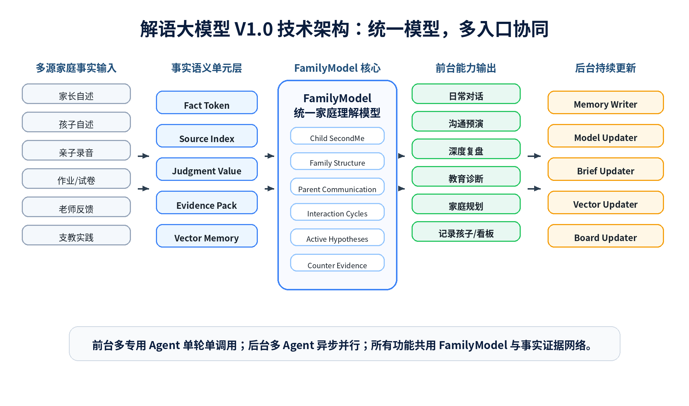

## 5.5 技术栈

| 层级 | 当前实现 |
|---|---|
| Web | Next.js App Router、React、TypeScript |
| 小程序 | Taro 3、React |
| BFF | Node.js、NDJSON 流式协议 |
| 数据 | PostgreSQL、分层 JSON 记忆、可选 pgvector |
| 模型 | DeepSeek 主模型，可选豆包家长向端点 |
| Embedding | 阿里百炼 text-embedding-v3 |
| 语音 | 腾讯云实时 ASR |
| 工程 | Prompt 注册表、任务队列、readiness、租户隔离 |

## 5.6 技术壁垒判断

育见当前最有潜力形成壁垒的不是单一模型参数，而是：

1. 家庭场景采集范式；
2. 原子事实、Episode、互动循环和反证的结构设计；
3. 多 Agent 读取与写入契约；
4. 长期使用形成的家庭级数据累积；
5. 前台必须锚定事实的生成门控；
6. 公益、学校和社区场景中的真实验证网络。

这些壁垒仍处于形成期，必须通过用户留存、模型准确性与渠道复用数据证明。

---

# 六、竞争格局

## 6.1 替代方案

| 类型 | 代表形态 | 优势 | 局限 |
|---|---|---|---|
| 通用大模型 | ChatGPT、DeepSeek、豆包等 | 能力广、成本低、使用方便 | 家庭上下文有限，容易泛化 |
| AI 学习工具 | 题目答疑、AI 家教 | 学习任务明确、结果可衡量 | 聚焦知识和题目，不理解家庭机制 |
| 心理咨询与家庭教育咨询 | 线下/线上人工服务 | 深度高、有人际信任 | 成本高、频次低、难持续沉淀 |
| 成长记录产品 | 日记、相册、成长档案 | 记录简单、情感价值高 | 缺少机制推理与决策支持 |
| 育见 | 长期家庭理解系统 | 家庭事实、SecondMe、任务验证与预演闭环 | 早期数据少，商业模式尚待验证 |

## 6.2 差异化

| 维度 | 通用问答 | 育见 |
|---|---|---|
| 使用起点 | 直接提问 | 先建立家庭上下文 |
| 事实来源 | 当前会话 | 四模块证据、历史 Episode、任务反馈 |
| 个性化 | 人设或短期记忆 | 家庭级 FamilyModel / SecondMe |
| 判断方式 | 单轮生成 | 检索、规则编排、机制假设与反证 |
| 行动闭环 | 给出建议 | 任务执行、预演、反馈、模型修正 |
| 输出边界 | 通用助手 | 非诊断、非评判、家长可见转译 |

## 6.3 SWOT

| 维度 | 判断 |
|---|---|
| 优势 | 产品链路完整；长期记忆与证据结构清晰；真实 UI 与双端基础；场景边界明确 |
| 劣势 | 用户规模小；推理成本和延迟依赖外部模型；品牌与合规体系仍需建设 |
| 机会 | 家庭教育法治化；AI 普及；教育数字化与家校社协同；家长对个性化理解需求提升 |
| 威胁 | 大厂通用 AI 免费化；未成年人数据监管；家长信任建立周期长；咨询类产品效果难量化 |

---

# 七、验证现状与运营基础

## 7.1 已完成

- Web 四 Tab 主产品与四模块 Onboarding。
- synthesis / diagnosis 初始画像管线。
- 日常交流流式 BFF、结构化 section 与 actions。
- Episode / FactAtom、分层记忆、向量召回和异步任务。
- 任务反馈、沟通预演、画像与机制链页面。
- 小程序主要功能代码迁移。
- 支教与公益合作所需的项目说明、合作意向书和沟通材料。

## 7.2 线上快照

2026 年 7 月 9 日扫描时，线上数据库快照约为：

| 指标 | 快照 |
|---|---:|
| 用户账号 | 22 |
| conversations | 165 |
| memory_layer_items | 3675 |

这些数据包含内部测试、演示或试点账号，不应直接解释为有效付费用户或市场 traction。

## 7.3 当前风险提示

扫描时线上登录页可访问，但 readiness 返回 `ready:false`，后台有 11 个失败任务。该问题应在对外路演和大规模试点前完成修复并复核。

微信小程序代码侧主流程较完整，但整个 `miniprogram/` 当前尚未进入 Gitee `master`，真机 ASR E2E 仍待验收。因此对外只能表述为“主要功能开发完成，处于发布验收阶段”。

## 7.4 用户验证缺口

目前尚缺以下权威数据：

- DAU、MAU、7/30 日留存；
- Onboarding 完成率；
- 每家庭有效输入与复访次数；
- “理解准确度”用户评价；
- 任务执行率与反馈率；
- 沟通预演后的真实效果；
- 付费意愿与可接受价格；
- 学校/社区采购意愿。

---

# 八、增长与验证路径

## 8.1 早期渠道假设

```text
高校公益与支教资源
→ 学校 / 社区 / 家长群
→ 种子家庭体验
→ 结构化回访与案例沉淀
→ 产品迭代与可信案例
→ 家庭订阅或机构服务包验证
```

当前项目已准备九州问学支教合作材料，并计划结合学校、社区和公益实践采集真实反馈。但支队数量、已签约合作方和实际触达家庭数存在资料口径差异，必须由团队统一确认。

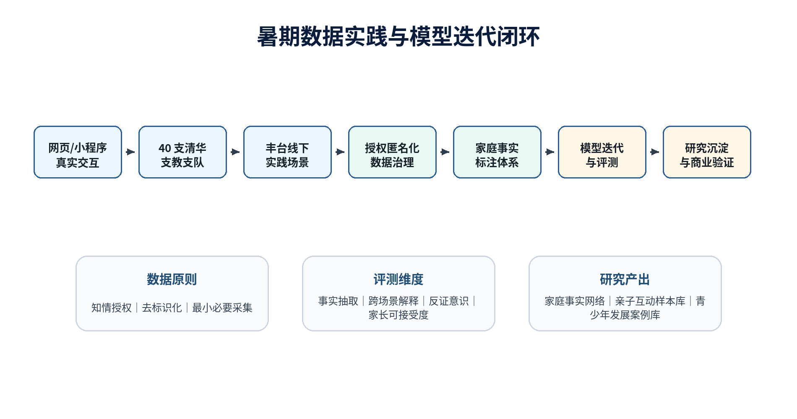

## 8.2 增长原则

- 先验证“家长是否持续使用”，再扩大流量。
- 先验证单个学校/社区的交付闭环，再复制渠道。
- 公益数据与商业数据分开管理，知情授权和最小必要采集前置。
- 不以未成年人敏感信息换取增长。

## 8.3 核心增长指标

| 阶段 | 应验证指标 |
|---|---|
| 激活 | Onboarding 完成率、首轮交流率 |
| 价值 | 家长认为“说的是我家”的比例、有效事实引用率 |
| 留存 | 7/30 日复访、每周有效输入家庭数 |
| 闭环 | 任务保存率、执行反馈率、预演使用率 |
| 渠道 | 单个合作方触达家庭数、激活成本、复用周期 |
| 商业 | 试用转付费、续费、机构采购周期 |

---

# 九、商业模式

## 9.1 商业化原则

当前以产品验证和公益试点为主，商业模式尚未完成实证。建议采用“家庭订阅验证产品价值，B2B2C 验证渠道效率”的双路径实验，而不是同时铺开四种模式。

## 9.2 路径一：家庭订阅

可能结构：

- 基础交流与轻量记录作为低门槛入口；
- 深度画像、更多预演、周期回顾和家庭报告作为增值能力；
- 按家庭而非按单个账号订阅。

待验证：价格、推理成本、月度使用频次、续费理由和家庭共享机制。

## 9.3 路径二：学校/社区/公益项目服务包

可能结构：

- 为学校、社区、基金会或支教项目提供家长支持工具；
- 提供匿名聚合的项目效果报告；
- 提供家长工作坊、使用支持和案例复盘。

待验证：采购主体、预算来源、交付责任、数据边界和销售周期。

## 9.4 暂不优先的路径

- 教育数据出售：未成年人和家庭数据风险高，不应作为早期收入核心。
- 纯 API 开放：当前产品价值依赖完整采集和交互闭环，过早 API 化可能削弱差异。
- 直接心理咨询收费：与产品边界和资质要求不符。

## 9.5 单位经济模型待补项

| 项目 | 当前状态 |
|---|---|
| 家庭订阅价格 | 待价格测试 |
| 单家庭月均模型成本 | 待按真实调用统计 |
| CAC | 待渠道试点 |
| 续费率 | 待验证 |
| 机构客单价 | 待采购访谈 |
| 毛利率 | 待价格和成本确定后计算 |

---

# 十、产品与技术路线图

## 10.1 已实现

- Web 主产品；
- 四模块 Onboarding；
- FamilyModel 多层工程实现；
- 流式交流、任务、预演、画像；
- 语音输入；
- 小程序主要功能代码。

## 10.2 近期重点（验证优先）

- 修复线上异步任务健康问题；
- 完成小程序入库、真机 ASR 和发布验收；
- 建立产品分析指标与用户访谈机制；
- 建立家庭知情授权、删除、导出和数据保留流程；
- 优化首字延迟与单家庭推理成本；
- 统一品牌、四模块口径和对外材料。

## 10.3 中期方向

- 完善任务反馈驱动的假设验证；
- 建立学校/社区合作方管理与匿名效果报告；
- 强化画像变化追踪；
- 建立可解释的模型质量评估集；
- 探索家庭订阅与机构服务包。

## 10.4 长期设想（尚未实现）

- 多模态家庭理解；
- 聊天记录导入分析；
- 作业过程连续分析；
- 语音情绪线索；
- FamilyModel 可视化；
- 面向家庭教育场景的模型微调；
- 合规的家庭教育智能体开放能力。

---

# 十一、团队与组织

## 11.1 当前已知信息

根据项目方提供的信息，团队为清华大学、北京师范大学、中国传媒大学相关成员组成的交叉团队，覆盖产品、AI 工程、教育与传播方向；项目材料提及清华大学 iCenter 公益创新场景。

上述信息尚缺成员级证明，正式对外版本需要补充：

| 角色 | 姓名 | 学校/机构 | 专业与履历 | 当前投入 |
|---|---|---|---|---|
| 项目负责人 | 待补充 | 待补充 | 待补充 | 全职/兼职待确认 |
| 技术负责人 | 待补充 | 待补充 | 待补充 | 待确认 |
| 产品负责人 | 待补充 | 待补充 | 待补充 | 待确认 |
| 教育/心理顾问 | 待补充 | 待补充 | 待补充 | 待确认 |
| 公益与渠道 | 待补充 | 待补充 | 待补充 | 待确认 |

## 11.2 关键组织缺口

- 有资质的未成年人保护与数据合规顾问；
- 家庭教育/发展心理学研究顾问；
- 用户研究和试点运营负责人；
- 商业化与机构销售负责人；
- 模型质量与安全评估机制。

---

# 十二、安全、合规与伦理

育见涉及家庭与未成年人信息，合规不是后置工作，而是产品基础设施。

## 12.1 当前产品边界

- 不做心理或医疗诊断；
- 不给家长与孩子评分；
- 不把家长评价直接写为孩子事实；
- 风险输入进入专用安全响应；
- 家长可见内容使用生活语言，不暴露内部理论标签。

## 12.2 必须建立的制度

- 明确监护人授权与未成年人信息处理说明；
- 数据最小化与分级分类；
- 家庭级租户隔离；
- 数据删除、导出和账号注销；
- 公益试点和商业场景数据分离；
- 匿名聚合报告的最小样本与去标识化标准；
- 高风险内容人工升级和外部转介机制；
- 模型输出免责声明与质量审计。

---

# 十三、融资逻辑与资金用途

## 13.1 融资逻辑

本项目若启动融资，资金应服务于“把技术原型验证成可重复商业系统”，而不是只扩大曝光。

融资前需要证明三件事：

1. 家长愿意持续提供真实片段并复访；
2. FamilyModel 能显著提升“准确、具体、像我家”的感受；
3. 至少一条获客或机构合作路径可以重复。

## 13.2 融资信息待补

| 项目 | 内容 |
|---|---|
| 本轮融资金额 | 【待团队补充】 |
| 投前/投后估值 | 【待团队补充】 |
| 拟稀释比例 | 【待团队补充】 |
| 资金使用周期 | 【待团队补充】 |
| 下轮里程碑 | 【待团队补充】 |

## 13.3 建议资金用途框架

- 产品与工程：小程序、数据闭环、性能和可观测性；
- 模型与算力：推理、Embedding、评估集和成本优化；
- 试点运营：用户研究、学校/社区合作和案例沉淀；
- 安全合规：制度建设、法律审查与未成年人保护；
- 核心团队：补齐教育研究、运营与商业化能力。

具体比例必须根据融资金额、团队成本和试点计划测算后填写。

---

# 十四、关键风险与应对

| 风险 | 影响 | 应对方向 |
|---|---|---|
| 通用大模型快速复制 | 功能差异被压缩 | 强化长期数据闭环、交互采集与验证体系 |
| 用户不愿持续输入 | FamilyModel 无法形成 | 语音优先、低负担交互、尽快反馈明确价值 |
| 输出误判 | 损害家长信任 | 事实锚定、低置信追问、反证和人工评估 |
| 未成年人数据风险 | 合规与声誉风险 | 最小化、隔离、授权、删除、审计 |
| 推理成本和延迟 | 单位经济受限 | Prompt cache、异步建模、模型分层和成本监控 |
| 公益渠道不能转商业 | 增长不可持续 | 公益验证与付费验证并行但数据隔离 |
| 团队兼职与能力缺口 | 交付节奏不稳定 | 明确核心全职成员和关键岗位补充计划 |

---

# 十五、未来 12 个月建议里程碑

## 阶段 A：稳定产品与测量体系

- readiness 恢复健康；
- 小程序正式进入版本管理并完成真机验收；
- 完成埋点、用户访谈和模型质量指标；
- 完成数据合规制度初版。

## 阶段 B：验证家庭端价值

- 完成一批结构化种子家庭测试；
- 形成可公开的匿名案例；
- 验证 7/30 日留存与任务反馈闭环；
- 完成家庭订阅价格实验。

## 阶段 C：验证机构渠道

- 完成学校、社区或公益项目服务包；
- 验证至少一个可重复合作流程；
- 明确采购主体、交付成本和续约条件；
- 形成融资或产业合作所需的数据证据。

所有家庭数、合作数和收入目标应由团队根据资源与预算补充，不在本母稿中虚构。

---

# 十六、结论

育见已经具备一套真实可运行的家庭教育 AI 产品及较完整的技术体系。其最重要的潜在价值不是“更会回答育儿问题”，而是把家庭日常转化为可以长期积累、被验证和被修正的理解系统。

项目下一阶段的核心不是继续增加概念，而是完成三项验证：

1. 真实家庭是否持续使用并感知到更深理解；
2. 公益、学校和社区渠道是否可以稳定触达并交付；
3. 家庭订阅或机构服务是否具备可持续单位经济。

在这些验证完成前，育见应以“产品验证期的家庭理解系统”对外表达；完成验证后，才有条件进一步成为家庭教育领域的长期记忆与决策支持基础设施。

---

# 附录 A：待团队补充清单

- 团队成员姓名、照片、履历与投入程度；
- 法律主体、股权结构与知识产权归属；
- 已签合作证明及准确支队/学校数量；
- 用户访谈、留存、任务反馈和案例数据；
- 家庭订阅价格测试；
- 机构采购访谈和预算；
- 模型调用成本与单家庭月成本；
- 融资金额、估值、稀释比例与预算；
- 数据合规法律意见；
- 竞品价格、用户规模和渠道调研。

# 附录 B：图片素材说明

| 图片 | 来源 | 用途与说明 |
|---|---|---|
| 01-登录入口 | 当前高保真 HTML 原型 | 展示真实产品入口 |
| 02-首次进入引导 | 当前高保真 HTML 原型 | 展示非问卷式信任建立 |
| 03-孩子基础信息 | 当前高保真 HTML 原型 | 展示基本背景采集 |
| 04-家庭信息采集 | 当前高保真 HTML 原型 | 展示语音优先的场景采集 |
| 05-AI阶段总结 | 当前高保真 HTML 原型 | 展示家长确认与低误判设计 |
| 06-孩子画像生成 | 当前高保真 HTML 原型 | 展示初始 SecondMe |
| 07-交流首页 | 当前主站 HTML 原型 | 展示四 Tab 主产品 |
| 08-AI深度分析 | 当前主站 HTML 原型 | 展示场景化理解 |
| 09-深度原因分析 | 当前主站 HTML 原型 | 展示机制链和待验证方向 |
| 10-FamilyModel画像 | 当前主站 HTML 原型 | 展示家庭模型家长可见层 |
| 11-任务陪伴模块 | 当前主站 HTML 原型 | 展示任务验证闭环 |
| 12-沟通预演模块 | 当前主站 HTML 原型 | 展示孩子接收视角预演 |
| 通用 AI 问题实测图 | 《解语大模型 V1.0 教师沟通版白皮书》 | 展示对比实验，正式使用前需保留测试方法说明 |
| FamilyModel 架构图 | 同上 | 展示技术结构 |
| Token 化闭环图 | 同上 | 展示产品技术闭环 |
| 暑期实践闭环图 | 同上 | 展示试点与模型迭代逻辑 |

> `00-封面.png` 含清华大学校徽与支持表述。本母稿未直接使用该图。未经相关单位确认，不应在融资材料中使用官方校徽或暗示正式背书。

# 附录 C：参考资料

[1] 教育部，《2024 年全国教育事业发展统计公报》，2025-06-11。
https://www.moe.gov.cn/jyb_sjzl/sjzl_fztjgb/202506/t20250611_1193760.html

[2] 全国人民代表大会常务委员会，《中华人民共和国主席令（第九十八号）》及《中华人民共和国家庭教育促进法》，2021-10-23。
https://www.moe.gov.cn/jyb_sjzl/sjzl_zcfg/zcfg_qtxgfl/202110/t20211025_574749.html

[3] 共青团中央维护青少年权益部、中国互联网络信息中心，《第 5 次全国未成年人互联网使用情况调查报告》，2023-12。
https://www.cnnic.cn/NMediaFile/2023/1225/MAIN1703484375296SPBHV29S0V.pdf

[4] 中国互联网络信息中心，第 57 次《中国互联网络发展状况统计报告》，2026-02-05。
https://cnnic.cn/n4/2026/0304/c88-11549.html

[5] 教育部等九部门，《关于加快推进教育数字化的意见》，教办〔2025〕3 号。
https://www.moe.gov.cn/srcsite/A01/s7048/202504/t20250416_1187476.html
