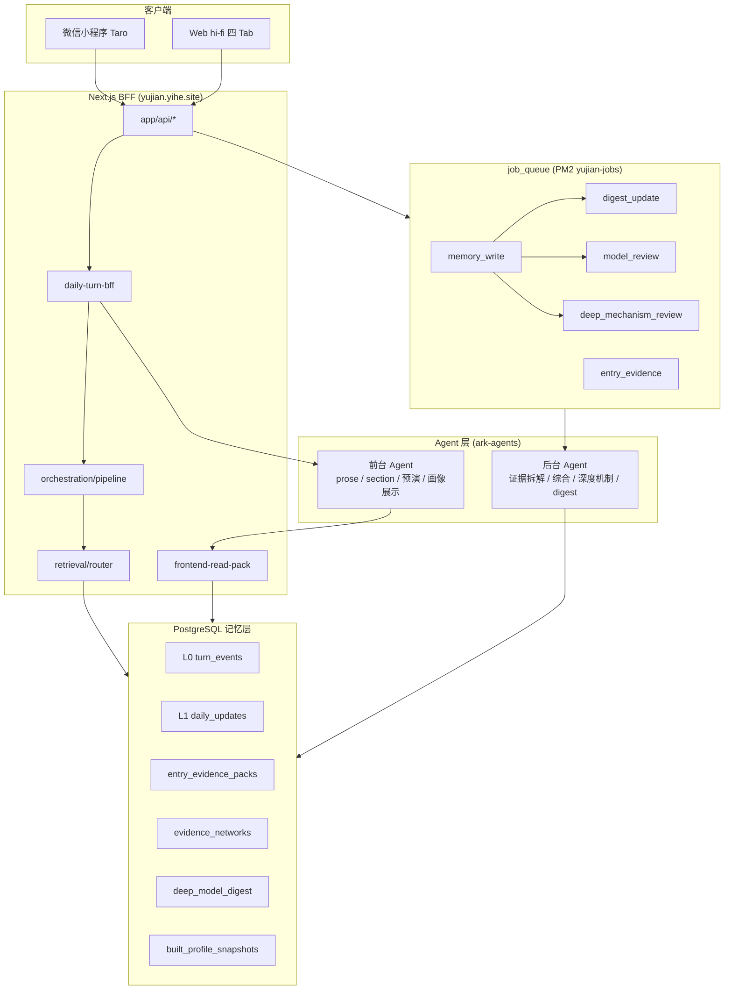
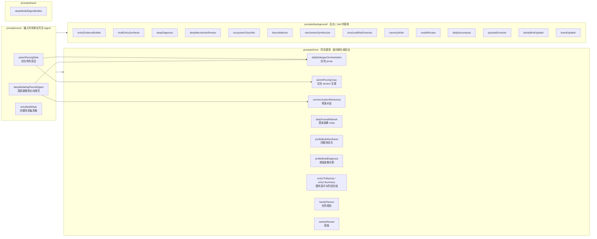
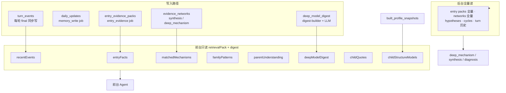
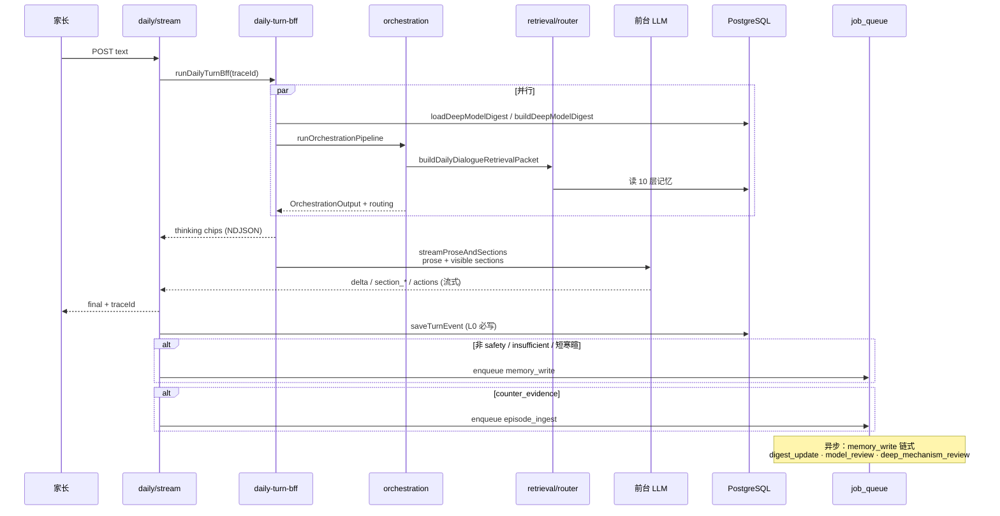
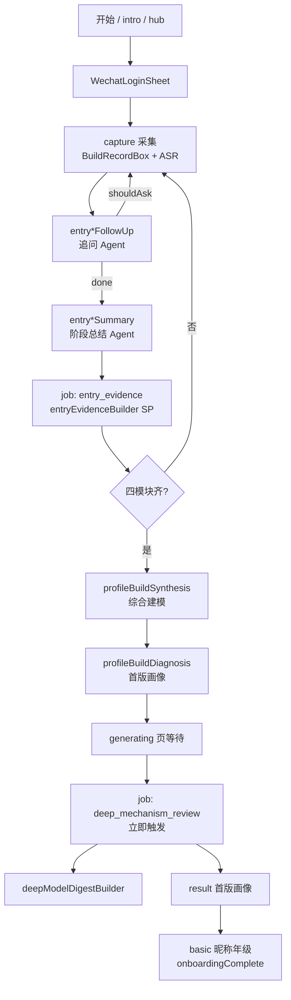
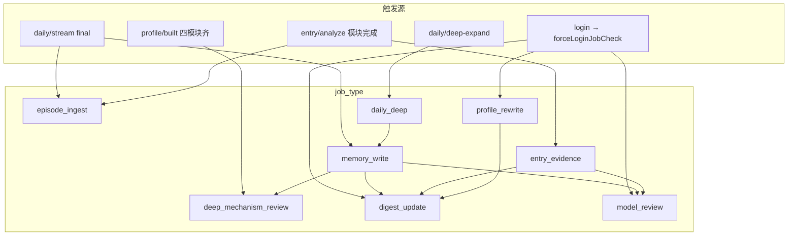
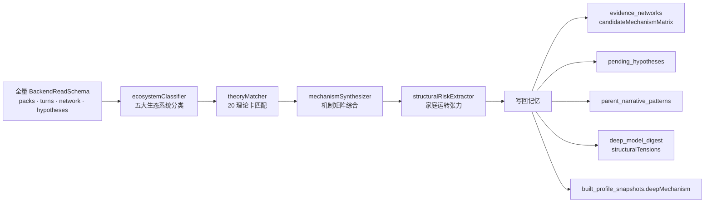
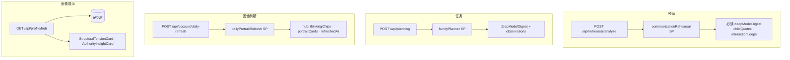

# 育见底层技术架构：Agent · SP · Job · 记忆

> 产品语义见 [`PRODUCT.md`](../../PRODUCT.md) · 设计映射见 [`DESIGN.md`](../../DESIGN.md)  
> 契约真源：`docs/contracts/memory-read.md` · `memory-write.md` · `read-contract.md` · `daily-stream-events.md`  
> SP 源文件：`prompts/**/*.md` → `npm run build` 生成 `src/lib/server/prompts/registry.generated.ts`

---

## 1. 系统总览



**运行形态**

| 进程 | 端口 | 职责 |
|------|------|------|
| `yujian` (PM2) | 3000 | Next.js Web + API；`CHILDOS_ENABLE_JOB_POLLER=off` |
| `yujian-jobs` (PM2) | 3010 | Job poller；消费 `job_queue` |
| `server.js` | — | 生产入口 + Web ASR WebSocket（讯飞签发） |

---

## 2. SP（System Prompt）分层

SP 不手写进代码，编辑 `prompts/**/*.md` 后由 `scripts/build-prompts.mjs` 编译进 `promptRegistry`。



### SP 组装规则（Prompt Cache）

| 调用场景 | system（稳定前缀） | user（动态 payload） |
|----------|-------------------|----------------------|
| 交流 prose | `parentFacingStyle` + `dailyDialogueOrchestration` + `deepModelingParentDigest` | `userText` + `retrievalPack` + `deepModelDigest` + `proseMode` |
| 交流 section | `parentFacingStyle` + `parentFacingCopy` + `deepModelingParentDigest` | 同上 + `sectionSkeletons` |
| 预演 analyze | `parentFacingStyle` + `communicationRehearsal` + `deepModelingParentDigest` | `parentText` + digest + retrievalPack |
| 四模块追问 | `entryBuildStyle` + `entry*FollowUp` | 模块 rawText + stage 上下文 |
| 深度机制 Job | `deepMechanismReview` 或链式 4 步 SP | 全量 BackendReadSchema |

实现入口：`src/lib/server/ark-agents.ts`（`callAgentJson` / `requireTextStream`）· `parent-facing-copy.ts`（`combinedProseSystem`）

---

## 3. 记忆读写边界



**铁律**：前台 Agent **只读不思考**（`pickFrontendReadPack`）；深度推理由后台 Job 写回后再被前台引用。

---

## 4. 交流 `/api/daily/stream` 一轮工作流



### Orchestration（无 LLM 的规则编排）

`src/lib/server/orchestration/pipeline.ts` — **不是**大模型，是 BFF 内 7 步调度：

1. 安全分级 `classifySafetyTier`
2. 检索 `buildDailyDialogueRetrievalPacket`（warmTurn 可走 session cache）
3. 输入分类 / 与已有模型关系（重复模式、反证、新机制…）
4. `routingDecision`：prose 模式、是否追问、frontResponseType
5. `composeDailySections` 骨架（section id / hidden）
6. `composeDailyActions`
7. 输出 `OrchestrationOutput` → 驱动 LLM payload

### 前台 LLM 并行策略

- **合并调用**：prose + visible sections 单次 `streamProseAndSections`（marker 流）
- **hidden sections**：后台第二次 LLM，不阻塞 actions / 输入解锁
- **深度展开**：`POST /api/daily/deep-expand` → `section-llm-enrich` + 可选 `daily_deep` job

---

## 5. Onboarding 四模块建档工作流



| API / 路由 | Agent / Job | 写入 |
|------------|-------------|------|
| `POST /api/entry/analyze` | `entry*FollowUp` / `entry*Summary` | `entry_records`；完成后 `entry_evidence` job |
| `POST /api/synthesis` | `profileBuildSynthesis` | 证据网络草案 → `memory_write` |
| `POST /api/diagnosis` | `profileBuildDiagnosis` | `built_profile_snapshots` → `memory_write` |
| `POST /api/profile/built` | — | 触发 `deep_mechanism_review`（`deep_mechanism:build:` 幂等键，不等日桶） |
| `POST /api/profile/basic` | — | `onboardingComplete`（需已有画像） |

---

## 6. 后台 Job 队列



### Job 说明表

| job_type | Handler | 主要 SP | 日桶 / 幂等 | 写入 |
|----------|---------|---------|-------------|------|
| `memory_write` | `executeWritePlan` | `memoryWrite`（计划 JSON） | per trace | `daily_updates`、叙事模式等 |
| `episode_ingest` | `ingestEpisodeStrict` | `episodeExtractor` | per trace | 向量 episode / fact_atoms |
| `entry_evidence` | `runEntryEvidenceBuild` | `entryEvidenceBuilder` | per module | `entry_evidence_packs` |
| `deep_mechanism_review` | `runDeepMechanismReview` | 见 §7 链 | **日桶** + build 立即键 | `evidence_networks`、假设、叙事、`structuralTensions` |
| `digest_update` | `rebuildBriefAndBoard` | `familyBriefUpdater` + `boardUpdater` | **每租户每天 1 次** | brief / board |
| `model_review` | `runModelReview` | `modelReview` | **每租户每天 1 次** | 假设权重 / 反证 |
| `daily_deep` | `runDailyDeep` → 链式 `memory_write` | `dailyDecompose` | per episode | 六维拆解 + 新假设 |
| `profile_rewrite` | `runProfileRewrite` | 专用 agent | **每 2 天 1 次** | 重写 `built_profile_snapshots` |

队列实现：`src/lib/server/jobs/queue.ts` · 状态：`pending` → `running` → `succeeded` / `failed` / `retrying`

家长可见追溯：`GET /api/daily/memory-status?traceId=` ← 查 `memory_write` / `episode_ingest` 状态

---

## 7. deep_mechanism_review 多 Agent 链



完成后链式：`deepModelDigestBuilder`（`prompts/back/deepModelDigestBuilder.md`）→ 供前台 `mechanismNarrative` / `anchoredFacts` / `childQuotes`。

---

## 8. 其他功能 Agent 路径



---

## 9. 小程序 ↔ BFF 对照

| 小程序页面 | BFF API | 前台 Agent | 后台 Job |
|------------|---------|------------|----------|
| `pages/daily` | `/api/daily/stream` | prose + section | `memory_write` |
| `pages/rehearsal` | `/api/rehearsal/analyze` | `communicationRehearsal` | — |
| `pages/tasks` | `/api/planning` | `familyPlanner` | — |
| `pages/profile` | `/api/profile/hub` + `daily-refresh` | `dailyPortraitRefresh` | `digest_update` |
| `packageOnboarding/capture` | `/api/entry/analyze` | `entry*FollowUp/Summary` | `entry_evidence` |
| `generating` | `/api/profile/built` + job 状态 | — | `deep_mechanism_review` |

---

## 10. 验证与审计

```bash
npm run audit:fullchain       # 推荐：test:contracts + audit-prompt-registry
npm run test:contracts        # 流式 + FrontendReadSchema + memory-contract
node scripts/audit-prompt-registry.mjs
node scripts/audit-memory-contract.mjs
node scripts/test-retrieval-packet.mjs
npm run audit:memory            # 可选：线上 DB 召回探测
```

收工清单：[docs/contracts/FULLCHAIN-SELF-CHECK.md](../docs/contracts/FULLCHAIN-SELF-CHECK.md)

---

## 相关文件索引

| 领域 | 路径 |
|------|------|
| 交流 BFF | `src/lib/server/daily/daily-turn-bff.ts` |
| 调度编排 | `src/lib/server/orchestration/pipeline.ts` |
| 检索打包 | `src/lib/server/memory/retrieval/router.ts` |
| 前台读包 | `src/lib/server/daily/frontend-read-pack.ts` |
| Prose 上下文 | `src/lib/server/daily/prose-context.ts` |
| Job 队列 | `src/lib/server/jobs/queue.ts` |
| 深度机制 | `src/lib/server/memory/deep-mechanism/reviewer.ts` · `pipeline.ts` |
| Digest | `src/lib/server/memory/deep-modeling/digest-builder.ts` |
| SP 注册表 | `src/lib/server/prompts/registry.generated.ts` |
| PM2 | `ecosystem.config.js` |
