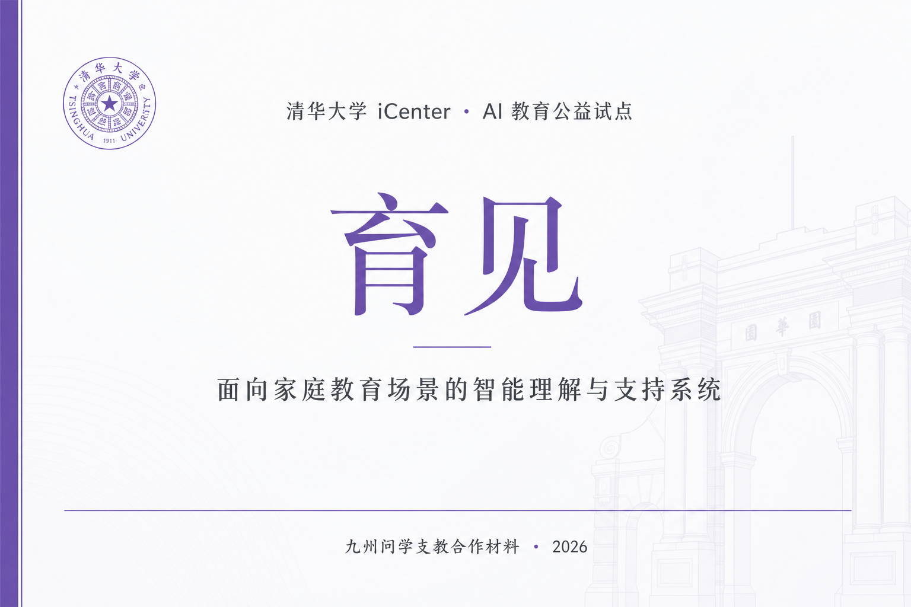

<div align="center">



# 育见 · 家庭教育 AI 理解与支持系统

## 项目技术说明

**清华大学 iCenter 支持 · AI 教育公益试点项目**

| 文档版本 | V1.0 |
|---------|------|
| 发布日期 | 2026 年 7 月 |
| 产品形态 | Web 端智能体（https://yujian.yihe.site） |
| 项目性质 | 公益试点 · 非商业推广 |

</div>

---

## 一、项目概述

### 1.1 我们在解决什么问题

在家庭教育场景中，许多家长并非缺少「育儿建议」，而是缺少**对自己孩子处境的系统理解**：

- 孩子拖延、发脾气、沉默、对抗，背后往往与家庭互动方式、压力结构、沟通节奏有关；
- 通用大模型（如豆包、DeepSeek 等）可以给出泛泛建议，但难以持续记住一个具体家庭、串联多个真实片段、形成「越用越懂这个孩子」的闭环；
- 支教、家校共育实践中，支队需要与家长建立信任，但缺少轻量、可信、可沉淀的数字化支持工具。

**「育见」（ChildOS / 心镜）** 是面向上述场景开发的 **家庭教育 AI 助手**，帮助家长在真实生活片段中，更系统地理解孩子、改善亲子沟通，并为支教团队、学校提供可授权的匿名化实践反馈。

### 1.2 项目定位

| 维度 | 说明 |
|------|------|
| **服务对象** | 焦虑但有反思意愿的家长（以支教覆盖学生家庭为主） |
| **核心能力** | 深度理解孩子 · 促进亲子沟通 · 沉淀可验证的成长支持 |
| **产品气质** | 温柔、可信、不评判；像「带过不少学生的师兄师姐」与家长面谈 |
| **明确不做** | 心理测评打分、诊断贴标签、强制商业化、替代学校教学 |

### 1.3 公益试点背景

本项目目前处于 **公益试点与真实场景验证阶段**：

- 九州问学 **暑期 30+ 支教支队** 逐步邀请合作学校参与体验；
- **北京市丰台区** 部分学校、社区开展线下试点；
- 全程 **免费、自愿参与、不强制家长使用**；
- 目标是在真实教育场景中收集反馈，迭代产品，服务学生家庭成长。

---

## 二、产品功能说明

### 2.1 家长端核心体验（四 Tab）

| 模块 | 功能 | 家长价值 |
|------|------|----------|
| **交流** | 语音/文字描述真实家庭片段 → AI 深度回应 | 获得比通用 AI 更贴近自家孩子的理解，而非鸡汤式建议 |
| **画像** | 长期沉淀孩子 SecondMe（结构化理解档案） | 看见孩子习惯、触发点、应对方式的变化 |
| **任务** | 从交流中生成「今晚可试」的小步行动 | 把理解转化为可验证、低压力的亲子尝试 |
| **预演** | 模拟「准备对孩子说的话，孩子可能怎么听」 | 减少沟通前的焦虑与误判 |

### 2.2 典型使用流程

```
注册登录 → 五入口画像采集（学习/作息/沟通/情绪/环境）
    → 解锁日常交流
    → 家长输入真实片段（如「催作业就发脾气」）
    → 系统检索家庭记忆 + 深度建模摘要
    → 流式输出：短回复 + 结构化分析 + 可行动建议
    → 长期越用越懂这个孩子
```

### 2.3 与通用 AI 的差异

| 对比项 | 通用大模型 | 育见 |
|--------|-----------|------|
| 记忆 | 单次对话为主 | 多层家庭记忆 + 深度建模摘要 |
| 输出 | 泛化建议多 | 必须锚定本家庭具体场景与原话 |
| 语气 | ChatGPT 式「万能助手」 | 清北学长/学姐面谈式，不评判家长 |
| 目标 | 回答问题 | 构建「越来越懂我家孩子」的闭环 |

---

## 三、技术架构与能力背书

### 3.1 总体架构

```
┌─────────────────────────────────────────────────────────┐
│                    家长 Web 端（育见）                      │
│   交流 · 画像 · 任务 · 预演  │  语音输入 · 流式输出        │
└───────────────────────────┬─────────────────────────────┘
                            │
┌───────────────────────────▼─────────────────────────────┐
│              日常交流 BFF（流式编排层）                     │
│  编排路由 · 记忆检索 · 深度摘要 · prose+section 合并流式   │
└───────────────────────────┬─────────────────────────────┘
                            │
        ┌───────────────────┼───────────────────┐
        ▼                   ▼                   ▼
┌──────────────┐   ┌──────────────┐   ┌──────────────┐
│ 多 Agent     │   │ 家庭记忆层    │   │ 大模型推理    │
│ 工作流       │   │ + 向量检索    │   │ DeepSeek 等   │
└──────────────┘   └──────────────┘   └──────────────┘
```

### 3.2 核心技术特点

**（1）多 Agent 深度建模（SecondMe）**

系统并非单次 Prompt 问答，而是由多个专用 Agent 分工协作：

- **采集 Agent**：五入口画像（学习作业、日常节奏、亲子沟通、情绪压力、关系环境）；
- **证据拆解 Agent**：把家长原话与事实结构化；
- **综合建模 Agent**：形成孩子机制链与家庭互动循环；
- **深度复核 Agent**：周期性校验机制假设，避免空泛判断；
- **日常前台 Agent**：每轮交流基于家庭记忆给出锚定事实的回应。

**（2）家庭记忆与检索增强（RAG）**

- 家长输入的具体场景、原话、事件存入分层记忆；
- 每轮交流自动检索相关历史，避免「每次从零开始」；
- 前台输出强制引用家庭事实，禁止编造未出现的行为与事件。

**（3）流式交互与低误判设计**

- 交流页支持 **thinking 四宫格**（让家长感知系统正在「读你家孩子」）；
- 正文与结构化 section **单次调用流式输出**，体验连贯；
- 低置信场景 **每轮最多一个追问**，先区分 A/B 再建议，降低误判。

**（4）隐私与边界**

- 家长自愿参与，数据按家庭隔离；
- 对外提供支队/学校的数据均为 **匿名化、聚合化** 实践反馈；
- 不做心理诊断标签，不给家长打分评级。

### 3.3 技术团队与工程实践

- 项目由 **清华大学 iCenter 支持的 AI 教育公益团队** 持续迭代；
- 采用现代 Web 全栈工程（Next.js、TypeScript、PostgreSQL、向量检索、PM2 生产部署）；
- 产品、设计、契约文档完备（`PRODUCT.md`、`DESIGN.md`、流式事件契约等）；
- 线上站点：https://yujian.yihe.site（公益试点环境）

---

## 四、支教场景应用价值

### 4.1 对学生家庭

- 帮助家长理解孩子在支教期间的学习与情绪变化；
- 提供可操作的亲子沟通建议，而非简单「多鼓励」；
- 长期沉淀孩子画像，看见成长轨迹。

### 4.2 对支教支队

| 场景 | 价值 |
|------|------|
| **家校沟通** | 家长群发布课堂照片、活动记录，增强信任与满意度 |
| **实践调研** | 群内问卷、满意度反馈、访谈招募更便捷 |
| **成果沉淀** | 获得匿名化家庭反馈数据，支撑调研报告、答辩材料 |
| **品牌背书** | 可介绍「清华 iCenter 支持的教育 AI 公益试点」 |

### 4.3 对学校

- 零负担公益试点，不涉及收费与教学干预；
- 可探索家庭教育、AI 助学、学生成长支持等长期合作；
- 有机会对接清华相关教育创新资源。

---

## 五、试点安排与合规说明

| 项目 | 说明 |
|------|------|
| **费用** | 全程免费 |
| **参与方式** | 家长自愿注册体验 |
| **数据使用** | 仅用于产品优化与匿名化研究；支队可获得授权范围内的聚合反馈 |
| **学校关系** | 以学校意见为准，不强制建群、不强制推广 |
| **项目状态** | 公益试点，产品持续迭代中 |

---

## 六、联系方式

如需进一步了解技术细节、申请试点支持或对接学校合作，请联系项目组：

- **产品体验**：https://yujian.yihe.site
- **合作咨询**：[请填写项目组联系人 / 微信 / 邮箱]

---

<div align="center">

*本文档仅供公益试点合作沟通使用*

**清华大学 iCenter · AI 教育公益试点 · 育见项目组**

</div>
